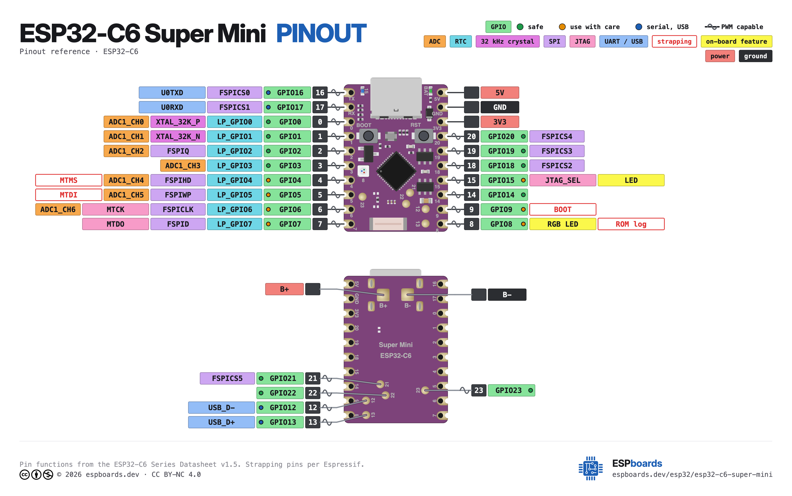

# Remote Wind Monitoring Station — Hardware Design

**Date:** 2026-09-22
**Author:** Coilette (for goos)
**Status:** Draft
**Related:** [power-budget.md](power-budget.md), [storage-budget.md](storage-budget.md)

---

## System Overview

```
  2× ER34615 Li-SOCl2 D-cell (3.6V, 38 Ah total)
       │
  ┌────┴─────┐
  │ HT7333   │ 3.3V LDO (~1 µA quiescent)
  └────┬─────┘
       │ 3.3V rail
  ┌────┼──────┬───────┬───────┬───────┬───────┐
  ▼    ▼      ▼       ▼       ▼       ▼
WindNerd ESP32  BME280 DS3231 SD card Piezo
 Core    C6                            rain
(STM32G0)                                (ADC)
  │      │
  │      ├─ GPIO1  → trigger → WindNerd
  │      ├─ GPIO4  ← UART RX  ← WindNerd TX2 (9600 baud)
  │      ├─ GPIO0  ← ADC      ← Piezo rain
  │      ├─ GPIO6/7 → I2C → BME280 (0x76) + DS3231 (0x68) + OLED (0x3C)
  │      ├─ GPIO2/3/18/19 → SPI → SD card
  │      ├─ GPIO14/20/21 ← EC11 rotary encoder
  │      ├─ GPIO22 ← WiFi enable switch
  │      ├─ GPIO22 → MOSFET gate → OLED VCC (power gate)
  │      └─ WiFi 6 soft-AP → phone/laptop (data retrieval)
```

**LP core** (5s loop): trigger WindNerd → read UART → read piezo ADC → buffer in RTC memory
**Main core** (1 min wake): read BME280 + DS3231 → flush buffered data to SD → return to deep sleep
**On demand** (WiFi switch): power on OLED → start WiFi AP → serve CSV files → return to sleep

---

## Components

### 1. WindNerd Core (wind sensor + MCU)

- **MCU:** STM32G031F8Px (Cortex-M0+, 32KB flash, 8KB RAM)
- **Sensors:** Rotor pulse counting (speed) + TMAG5273 magnetic angle (direction)
- **Output:** USART2 @ 9600 baud, TX2 pin (yellow wire)
- **Input:** GPIO interrupt (our trigger pin)
- **Power:** 3.3V or 5V (onboard regulator accepts either)
- **Programming:** ST-Link V2 (SWD: CLK, DIO, RST, GND) or serial bootloader
- **Current:** ~0.04 mA (custom firmware, STOP mode, on-demand)
- **Source:** [windnerd.net](https://windnerd.net/en/shop) — kit includes board, magnets, bearings
- **3D files:** [windnerd-labs/Anemometer-3D-files](https://github.com/windnerd-labs/Anemometer-3D-files)

### 2. ESP32-C6 SuperMini (datalogger)

- **MCU:** ESP32-C6 (RISC-V single core, 160MHz, LP RISC-V coprocessor)
- **Flash:** 4 MB
- **WiFi:** WiFi 6 (802.11ax)
- **BLE:** BLE 5.3
- **Deep sleep:** ~7 µA (with LP core active)
- **GPIO:** 22 broken out (silkscreen 0–9, 12–15, 16/TX, 17/RX, 18–23) on SuperMini form factor
- **Power:** 3.3V (onboard 3.3V LDO accepts 5V via USB or 3.3V direct)
- **Programming:** USB-C (native USB, no UART adapter needed)

### 3. BME280 (temp / RH / pressure)

- **Interface:** I2C (address 0x76 or 0x77 depending on breakout)
- **Power:** 3.3V
- **Current:** 3.6 µA sleep, 12 mA peak (2ms forced read)
- **Breakout:** Common BME280 modules from Adafruit, Pimoroni, or generic Aliexpress. Any I2C breakout works.
- **Notes:** Needs a radiation shield for accurate temp/RH. Without one, sun heats the sensor and readings are garbage. A simple louvered 3D-printed Stevenson screen works.

### 4. DS3231 (RTC)

- **Interface:** I2C (address 0x68 — no conflict with BME280)
- **Power:** 3.3V (VCC) + CR1220 coin cell (backup)
- **Accuracy:** ±2 ppm (temperature-compensated crystal oscillator)
- **Drift:** ±5 minutes over 6 months
- **Current:** 0.8 µA (battery-backup mode)
- **Breakout:** Common DS3231 "Tiny RTC" or "Precision RTC" modules. Most include a CR1220 holder.
- **Notes:** Some cheap DS3231 modules ship with a rechargeable LIR2032 battery + charging circuit. **Remove the charging circuit** (cut trace or remove diode) if using a primary CR1220 — charging a non-rechargeable coin cell is a fire hazard.

### 5. Piezo Rain Sensor — DIY Disdrometer

- **Interface:** Analog voltage (ADC, GPIO0)
- **Power:** 3.3V (passive — piezo generates its own voltage, no power needed except op-amp if used)
- **Type:** Piezoelectric disc impact disdrometer (no moving parts)
- **Cost:** ~$2-5

#### How it works

A piezo disc is bonded to the underside of a flat rigid plate (acrylic, polycarbonate, or thin PCB). Raindrops hit the plate, transferring kinetic energy through the plate to the piezo, which generates a voltage spike proportional to the impact force. Bigger drops = bigger spikes. More drops per second = higher rain rate.

The piezo signal is bipolar AC (mV to several volts). A simple conditioning circuit biases it to VCC/2, clamps the peaks to protect the ADC, and optionally a peak detector holds the maximum between samples.

#### Signal conditioning circuit (v1 — simplest)

```
Piezo disc ──┬── 10MΩ ── VCC/2 (voltage divider: 2× 10MΩ)
            ├── Schottky clamps (BAT54S: to GND and 3.3V)
            ├── 100nF cap to GND (noise filter)
            └── ADC input (GPIO0)
```

No op-amp. The piezo voltage for moderate-heavy rain is 50mV-5V. The ESP32-C6 ADC (12-bit, 0-3.3V) has ~0.8mV resolution. Light rain may be near the noise floor — acceptable for v1.

The LP core reads the ADC at 5s intervals and records the **peak value** since the last read (firmware tracks max in a variable, resets after each sample). This gives a rain intensity proxy per 5s interval.

#### Signal conditioning circuit (v2 — with op-amp, if v1 lacks sensitivity)

```
Piezo disc ──┬── 10MΩ bias to VCC/2
            ├── Schottky clamps
            └── OPA376 (gain = 10×, 0.9 µA quiescent)
                 └── Peak detector (Schottky + 10nF cap + 10MΩ bleed)
                      └── ADC input (GPIO0)
```

OPA376: 0.9 µA quiescent, rail-to-rail, $1.50. Gain of 10× brings mV-level drizzle signals into the ADC's usable range. Peak detector holds the max impact voltage between 5s samples.

#### Catch surface design

- **Material:** 3mm polycarbonate or acrylic, ~50-100mm diameter
- **Piezo:** 27mm or 35mm piezo disc (standard buzzer element, $0.50)
- **Mounting:** Piezo bonded to center of disc underside with epoxy. Disc mounted level, exposed to sky.
- **Drainage:** Slight tilt or textured surface so water doesn't pool. Pooling dampens the signal.
- **Size:** ~20 cm² catch area is the sweet spot — large enough to catch drops, small enough that simultaneous impacts rarely overlap (per the literature).

#### Calibration

Piezo output is not in mm/hr — it's a raw voltage/impact count. Calibration maps the signal to rain rate. Several approaches from the literature:

1. **Simple threshold counting:** Count ADC peaks above a threshold per interval. More peaks = more rain. Crude but functional. Calibrate against a reference gauge by finding the threshold and scaling factor that matches.

2. **Peak amplitude integration:** Sum (or average) the peak amplitudes per interval. Higher amplitude = bigger drops = more rain. Better correlation with rain rate than pure count.

3. **ML-based calibration:** Train a model (random forest, etc.) on features extracted from the signal (peak count, peak amplitude distribution, RMS energy, frequency content) against a reference rain gauge. Best accuracy per the research literature.

4. **Field calibration:** Deploy alongside a known reference (tipping bucket, manual gauge, or nearby weather station) for a few rain events. Correlate raw piezo data with known rain rates. Derive a calibration curve. Apply retroactively to the full dataset.

For v1: **log raw ADC peak values** (peak amplitude per 5s interval). Calibrate later against a reference. The raw data is preserved — any calibration method can be applied retroactively.

#### Reference designs and literature

| Source | What it provides | Link |
|---|---|---|
| **Delft University disdrometer** | Full DIY build guide with circuit, firmware, and calibration approach. Instructables with photos and code. | [instructables.com](https://www.instructables.com/Make-an-acoustic-rain-gauge-disdrometer/) |
| **IOPScience — piezo-buzzer disdrometer** | Academic paper with full circuit (sensor → op-amp → filter → ADC), Arduino firmware, and calibration against a reference gauge. Uses DS3231 RTC (same as us!). | [iopscience.iop.org](https://iopscience.iop.org/article/10.1088/1742-6596/2034/1/012023/pdf) |
| **MDPI — ML calibration paper** | Low-cost piezo sensor with ML-based calibration. Extracts signal features and trains models against reference rain gauge data. Best accuracy approach. | [mdpi.com](https://www.mdpi.com/1424-8220/22/17/6638) |
| **Ravi Bagree thesis** | Detailed readout circuit characterization for piezo disdrometer. Covers impedance matching, gain stages, and noise analysis. | [scribd.com](https://www.scribd.com/document/273071512/) |
| **ICFOSS Acoustic Raingauge** | Open source GitHub project. Uses acoustic sensors + ML to estimate precipitation. Python analysis scripts included. | [github.com/harikrishnan-kp/Acoustic_Raingauge](https://github.com/harikrishnan-kp/Acoustic_Raingauge) |
| **Analog Devices CN-0350** | Charge-mode piezo sensor ADC reference design. Industrial-grade signal chain for piezoelectric sensors. Overkill but good theory. | [analog.com](https://www.analog.com/media/en/reference-design-documentation/reference-designs/CN0350.pdf) |
| **"Affordable Acoustic Disdrometer" paper** | Design, calibration, and field tests of a low-cost piezo disdrometer. 20 cm² catch area, validates the approach. | [researchgate.net](https://www.researchgate.net/publication/241375116_Affordable_Acoustic_Disdrometer_Design_Calibration_Tests) |

#### Power

| Component | Current | Notes |
|---|---|---|
| Piezo disc (passive) | 0 µA | Generates its own voltage, no power needed |
| Bias divider (2× 10MΩ) | ~0.16 µA | 3.3V / 20MΩ |
| Op-amp (OPA376, if used) | 0.9 µA | Only needed for v2 with amplification |
| **Total (v1, no op-amp)** | **~0.16 µA** | Negligible |
| **Total (v2, with op-amp)** | **~1.1 µA** | Still negligible |

### 6. MicroSD Card Module

#### Does the chipset matter?

**No.** SD card modules are dumb SPI-to-SD-card adapters. The "chipset" is just a level shifter (or not) and an SD card slot. The ESP32-C6 handles all SD protocol in firmware via SPI.

What matters:

| Factor | Why it matters |
|---|---|
| **Voltage** | Must be 3.3V logic. Some cheap modules have a 5V→3.3V LDO + level shifter (the "CATALEX" style). These work but waste power in the LDO. A bare 3.3V SPI microSD breakout is better for low power. |
| **SPI vs SDIO** | SPI mode uses 4 pins (MOSI, MISO, SCK, CS). SDIO mode uses 6 pins but is faster. We don't need speed — SPI is fine and saves 2 pins. |
| **Slot quality** | Cheap modules have flaky card slots. A proper spring-loaded microSD holder matters for 6 months of vibration/wind. |
| **No onboard LED** | Some modules have a power LED. Desolder it — wastes ~1 mA constantly. |

#### Recommended module

**Bare SPI microSD breakout (3.3V, no level shifter, no LED).**

Common options:
- **Adafruit microSD SPI breakout** — $4.95, clean 3.3V design, no LED, reliable slot
- **SparkFun microSD Transflash breakout** — similar
- **Generic "microSD SPI module" (no LDO version)** — $1-2 on Aliexpress. Look for ones without the AMS1117 LDO chip. If it has an LDO, it's the 5V-compatible version — works but wastes power.

**Key:** Get one that's 3.3V-only (no LDO, no level shifter). The ESP32-C6 is 3.3V logic — direct SPI is cleanest and lowest power.

#### Wiring

| SD pin | ESP32-C6 GPIO | Notes |
|---|---|---|
| VCC (3.3V) | 3.3V | Direct from ESP32-C6 3.3V rail |
| GND | GND | |
| MOSI | GPIO assigned | SPI MOSI |
| MISO | GPIO assigned | SPI MISO |
| SCK | GPIO assigned | SPI clock |
| CS | GPIO assigned | Chip select (active low) |

#### SD card

- **Capacity:** 8 GB (we need ~168 MB for 6 months — 8 GB has 47× headroom)
- **Type:** Industrial pSLC for cold + power-loss resilience
- **Recommended:** Transcend Industrial 8GB (-40°C) or SanDisk High Endurance 32GB
- **Format:** FAT32 (8 GB or smaller) or exFAT (larger). FAT32 is simpler and well-supported on ESP32.

---

## Pin Allocation — ESP32-C6 SuperMini


> esp32-c6 supermini from <https://www.espboards.dev/esp32/esp32-c6-super-mini/#pinout>

The ESP32-C6 SuperMini breaks out **22 GPIO** with silkscreen labels 0–9, 12–15, 16(TX), 17(RX), 18–23. GPIO10 and GPIO11 are **not broken out** — internal flash pins.

**Board layout** (USB port facing up):

| Left side | → | Right side |
|---|---|---|
| 16, 17, 0, 1, 2, 3, 4, 5, 6, 7, 23, 22 | | 5V, GND, 3V3, 20, 19, 18, 15, 14, 9, 8, 12, 13, 21 |

**Safe pins** (no boot/system duties): 0, 1, 2, 3, 14, 18, 19, 20, 21, 22, 23
**Strapping pins**: 2, 4, 5, 6, 7, 8, 9, 15
**UART0**: 16 (TX), 17 (RX) — free if using native USB for programming
**USB**: 12 (D−), 13 (D+) — do not use
**Onboard LEDs**: 8 (WS2812 RGB), 15 (status LED) — keep off in firmware for low power

| Silkscreen | GPIO | Function | Core | Pin status | Capabilities | Notes |
|---|---|---|---|---|---|---|
| 0 | GPIO0 | **ADC — piezo rain** | LP core | safe | ADC1_CH0, LP_GPIO0 | LP core reads ADC at 5s. Low-noise analog pin. |
| 1 | GPIO1 | **WindNerd trigger (output)** | LP core | safe | ADC1_CH1, LP_GPIO1 | LP core toggles every 5s to wake WindNerd |
| 2 | GPIO2 | **SPI SCK (SD card)** | Main core | strapping | ADC1_CH2, LP_GPIO2, FSPIQ | SD card clock. SPI clock idles low — 10kΩ pull-down keeps boot-safe. |
| 3 | GPIO3 | **SPI CS (SD card)** | Main core | safe | ADC1_CH3, LP_GPIO3 | SD card chip select (active low). 10kΩ pull-up keeps CS high during boot. |
| 4 | GPIO4 | **UART RX from WindNerd** | LP core | strapping | ADC1_CH4, LP_GPIO4, LP_UART_RXD, MTMS | LP_UART RX. UART idles high — 10kΩ pull-up keeps boot-safe. |
| 5 | GPIO5 | — FREE | — | strapping | ADC1_CH5, LP_GPIO5, LP_UART_TXD, MTDI | Available. Only free ADC pin (but strapping). |
| 6 | GPIO6 | **I2C SDA (BME280 + DS3231 + OLED)** | Main core | strapping | ADC1_CH6, LP_GPIO6, MTCK, FSPICLK | Shared I2C bus, three devices (0x76, 0x68, 0x3C) |
| 7 | GPIO7 | **I2C SCL (BME280 + DS3231 + OLED)** | Main core | strapping | LP_GPIO7, MTDO, FSPID | Shared I2C bus |
| 8 | GPIO8 | — FREE (onboard RGB LED) | — | strapping | WS2812 RGB LED | Keep OFF in firmware. Desolder if sleep current too high. |
| 9 | GPIO9 | — FREE (onboard BOOT button) | — | strapping | BOOT button | Internal pull-up. Avoid external loads. |
| 12 | GPIO12 | — RESERVED | — | USB | USB_D− | Native USB (programming). Do not use. |
| 13 | GPIO13 | — RESERVED | — | USB | USB_D+ | Native USB (programming). Do not use. |
| 14 | GPIO14 | **EC11 rotary encoder CLK** | Main core | safe | General purpose | Encoder clock (interrupt) |
| 15 | GPIO15 | — FREE (onboard status LED) | — | strapping | JTAG, LED | Status LED. Keep OFF in firmware. Avoid as High-Z input. |
| 16 (TX) | GPIO16 | — FREE | — | uart | UART0 TX, FSPICS0 | Free if using native USB (we are). Available for LTE modem or future use. |
| 17 (RX) | GPIO17 | — FREE | — | uart | UART0 RX, FSPICS1 | Free if using native USB (we are). Available for LTE modem or future use. |
| 18 | GPIO18 | **SPI MOSI (SD card)** | Main core | safe | SDIO CMD, FSPICS2 | SD card data out |
| 19 | GPIO19 | **SPI MISO (SD card)** | Main core | safe | SDIO CLK, FSPICS3, I2C SCL (alt) | SD card data in |
| 20 | GPIO20 | **EC11 rotary encoder DT** | Main core | safe | SDIO DATA0, FSPICS4, I2C SDA (alt) | Encoder data |
| 21 | GPIO21 | **EC11 rotary encoder SW** | Main core | safe | SDIO DATA1, FSPICS5 | Encoder push button (input, pull-up) |
| 22 | GPIO22 | **WiFi enable switch** | Main core | safe | SDIO DATA2 | Switch to GND = enable WiFi AP + display |
| 23 | GPIO23 | — FREE | — | safe | SDIO DATA3 | Available for future expansion |

**Summary:**

| Category | Count | Silkscreen pins |
|---|---|---|
| Used (LP core) | 3 | 0 (ADC), 1 (trigger), 4 (UART RX) |
| Used (main core) | 10 | 2 (SCK), 3 (CS), 6 (SDA), 7 (SCL), 14 (ENC CLK), 18 (MOSI), 19 (MISO), 20 (ENC DT), 21 (ENC SW), 22 (WiFi switch) |
| Reserved (USB) | 2 | 12, 13 |
| **Free** | **7** | 5, 8, 9, 15, 16(TX), 17(RX), 23 |

**7 free GPIO** for future expansion: LTE modem UART (16/17 TX/RX — perfect since we use native USB, or 23 + 5), battery voltage monitoring (5 ADC, but strapping), status LED (15 onboard).

### Pin assignment rationale

- **LP core pins (0–4):** The LP RISC-V core can only access LP_GPIO0–7. We use pin 0 for ADC (piezo), pin 1 for trigger output, and pin 4 for LP_UART RX. All three are LP-accessible.
- **LP_UART on pin 4:** The ESP32-C6's LP_UART defaults to GPIO4 (RXD) and GPIO5 (TXD). We only need RX (WindNerd sends data, we don't send back). Pin 4 is a strapping pin (MTMS) but UART idles high, so a 10kΩ pull-up keeps it boot-safe.
- **I2C on pins 6/7:** Shared I2C bus with three devices: BME280 (0x76), DS3231 (0x68), SH1106 OLED (0x3C). No address conflicts. These are the LP_I2C default pins but we use them with the main core's I2C peripheral.
- **SPI on pins 2/3/18/19:** SPI is remapped via GPIO matrix. Pins 2/3 are on the left header, pins 18/19 on the right header. All avoid USB and are safe/low-conflict. Pins 10/11 do not exist on this board. Pins 18–23 are the ESP32-C6's native SDIO peripheral — 4-bit SDIO mode would use 6 pins (18–23) and consume GPIO20/21 (encoder DT/SW) and GPIO22 (WiFi switch). We deliberately choose SPI mode (4 pins) over SDIO mode (6 pins) because the data rate is trivial (~838 KB/day, 70-byte appends once per minute) and the 2 saved pins keep the encoder and WiFi switch on safe, non-strapping GPIO. SDIO's speed advantage is irrelevant when the SD card is asleep 55s out of every 60s.
- **ADC on pin 0:** ADC1_CH0, lowest-conflict ADC pin. LP core reads it at 5s intervals.
- **OLED on shared I2C:** SH1106 1.3" OLED shares the pin 6/7 I2C bus. Address 0x3C — no conflict. Display is power-gated by MOSFET (only on when WiFi switch is engaged).
- **Rotary encoder on pins 14/20/21:** EC11 encoder (CLK, DT, SW). All safe pins, non-strapping, non-USB. CLK on pin 14 for interrupt-driven rotation detection.
- **WiFi enable switch on pin 22:** Physical switch to GND. When closed, triggers GPIO interrupt to wake main core, power on OLED via MOSFET, start WiFi AP. When opened, shuts everything down and returns to deep sleep.
- **Onboard LEDs:** Pin 8 (WS2812 RGB) and pin 15 (status LED) have onboard LEDs. Both are strapping pins and left free. Firmware must keep them OFF — the WS2812 draws ~1 mA even when showing black. Desolder the RGB LED if it causes sleep current issues.

### Deep sleep current note

Per [measurements on this exact board](https://dmelo.eu/blog/esp32c6_deepsleep/), deep sleep current is in the **tens of microamps** — higher than the ESP32-C6 datasheet's bare-module figure of ~7 µA. The onboard LTH7R charger IC and passive components add overhead. Our power budget estimate (~0.018 mA for ESP32-C6) may be optimistic by 2-5×. **Plan to measure actual sleep current on the specific board** and update the power budget accordingly. Desoldering the RGB LED (pin 8) and status LED (pin 15) may help reduce sleep current.

---

## Inter-board Wiring

### WindNerd Core ↔ ESP32-C6

| WindNerd pin | ESP32-C6 pin | Wire color | Function |
|---|---|---|---|
| TX2 (yellow) | GPIO4 (LP_UART RX) | Yellow | Wind data output → ESP32-C6 LP core reads |
| GND | GND | Black | Common ground |
| GPIO (trigger) | GPIO1 | Green | ESP32-C6 LP core triggers WindNerd read |
| VCC | 3.3V (LDO) | Red | WindNerd powered from shared 3.3V LDO rail |

**Notes:**
- UART is one-way (WindNerd TX → ESP32-C6 RX). No need for RX on WindNerd — the trigger is a separate GPIO, not UART.
- Pull-up resistor (10kΩ) on the trigger line — keeps WindNerd's GPIO stable during ESP32 deep sleep.
- UART line: 9600 baud, short distance (inside enclosure, ~10cm). No level shifter needed — both are 3.3V logic.

### BME280 ↔ ESP32-C6

| BME280 pin | ESP32-C6 pin | Notes |
|---|---|---|
| VCC (3.3V) | 3.3V (LDO) | |
| GND | GND | |
| SDA | GPIO6 (I2C SDA) | Shared with DS3231 |
| SCL | GPIO7 (I2C SCL) | Shared with DS3231 |

### DS3231 ↔ ESP32-C6

| DS3231 pin | ESP32-C6 pin | Notes |
|---|---|---|
| VCC (3.3V) | 3.3V (LDO) | |
| GND | GND | |
| SDA | GPIO6 (I2C SDA) | Shared with BME280 + OLED |
| SCL | GPIO7 (I2C SCL) | Shared with BME280 + OLED |
| CR1220+ | — | Backup battery on DS3231 module |

### OLED Display (SH1106) ↔ ESP32-C6

| OLED pin | ESP32-C6 pin | Notes |
|---|---|---|
| VCC (3.3V) | 3.3V (LDO) | Power gated by WiFi switch — display only on when human present |
| GND | GND | |
| SDA | GPIO6 (I2C SDA) | Shared with BME280 + DS3231 (address 0x3C) |
| SCL | GPIO7 (I2C SCL) | Shared with BME280 + DS3231 |

### Rotary Encoder (EC11) ↔ ESP32-C6

| EC11 pin | ESP32-C6 pin | Board label | Notes |
|---|---|---|---|
| CLK | GPIO14 | 14 | Rotary encoder clock (interrupt) |
| DT | GPIO20 | 20 | Rotary encoder data |
| SW | GPIO21 | 21 | Push button (input, pull-up) |
| VCC | 3.3V (LDO) | 3V3 | |
| GND | GND | GND | |

### WiFi Enable Switch ↔ ESP32-C6

| Switch pin | ESP32-C6 pin | Board label | Notes |
|---|---|---|---|
| One side | GPIO22 | 22 | Input with internal pull-up |
| Other side | GND | GND | Switch to GND = enable |

**Note:** GPIO22 (board label "22") is configured as input with pull-up. When switch closes (to GND), it triggers a GPIO interrupt that wakes the main core from deep sleep. Main core then powers on the OLED via MOSFET, starts WiFi AP, and enters interactive mode. When switch opens, main core shuts down display + WiFi and returns to deep sleep.

### Piezo Rain ↔ ESP32-C6

| Piezo pin | ESP32-C6 pin | Notes |
|---|---|---|
| VCC (3.3V) | 3.3V (LDO) | Only if op-amp used (v2 circuit) |
| GND | GND | |
| Analog out | GPIO0 (ADC1_CH0) | LP core reads at 5s |

### MicroSD ↔ ESP32-C6

| SD module pin | ESP32-C6 pin | Silkscreen | Notes |
|---|---|---|---|
| VCC (3.3V) | 3.3V (LDO) | 3V3 | Direct 3.3V, no LDO module |
| GND | GND | GND | |
| MOSI | GPIO18 | 18 | |
| MISO | GPIO19 | 19 | |
| SCK | GPIO2 | 2 | |
| CS | GPIO3 | 3 | |

---

## Power Distribution

### Battery → Regulator → All components

```
2× ER34615 Li-SOCl2 D-cell (3.6V, 38 Ah total)
       │
       └── 3.3V LDO (HT7333 or similar, ~1 µA quiescent)
              │
              ├── WindNerd Core VCC (accepts 3.3V)
              ├── ESP32-C6 SuperMini 3V3
              ├── BME280 VCC
              ├── DS3231 VCC
              ├── Piezo rain VCC (if op-amp used)
              └── SD card VCC
```

Everything runs through the 3.3V LDO for wiring simplicity. One rail, one regulator.

### Regulator selection

The Li-SOCl2 D-cell nominal voltage is 3.6V, fresh up to 3.67V. The 3.3V LDO drops this to a clean 3.3V for all components.

**LDO:** HT7333 or similar (3.3V, ~1 µA quiescent, SOT-89 package). The HT7333 handles up to 250 mA — our entire system draws < 1 mA average, with brief peaks ~30 mA during SD writes. Plenty of margin.

**Why not direct battery?** Fresh Li-SOCl2 at 3.67V is slightly over spec for 3.3V components (BME280, DS3231, SD card rated 2.97–3.63V). The LDO adds ~1 µA quiescent and solves this cleanly. One rail for everything simplifies wiring.

**Why not buck converter?** At ~0.10 mA average, LDO efficiency is ~92% (3.3/3.6). A buck converter's quiescent (~5-20 µA) would exceed the savings. Not worth it.

### Power consumption

| Component | v1 (no op-amp) | v2 (with op-amp) | Notes |
|---|---|---|---|
| WindNerd Core (custom firmware, STOP mode) | ~0.04 mA | ~0.04 mA | |
| ESP32-C6 SuperMini (deep sleep + LP core) | ~0.018 mA | ~0.018 mA | Datasheet figure; actual board may be 2-5× higher (see note below) |
| BME280 (I2C, read every 1 min) | ~0.005 mA | ~0.005 mA | |
| DS3231 RTC (I2C, read every 1 min) | ~0.001 mA | ~0.001 mA | |
| Piezo rain v1 (bias divider only) | ~0.0002 mA | — | 2× 10MΩ divider (~0.16 µA) |
| Piezo rain v2 (OPA376 op-amp) | — | ~0.0011 mA | 0.9 µA op-amp + 0.16 µA divider |
| SD card (write every 1 min) | ~0.01 mA | ~0.01 mA | |
| LDO quiescent | ~0.001 mA | ~0.001 mA | |
| Inter-board pull-ups | ~0.01 mA | ~0.01 mA | UART + trigger line |
| **Total from battery** | **~0.10 mA** | **~0.10 mA** | |

**Deep sleep caveat:** Per [measurements on this exact board](https://dmelo.eu/blog/esp32c6_deepsleep/), deep sleep current is in the **tens of microamps** — higher than the ESP32-C6 datasheet's ~7 µA figure. The onboard LTH7R charger IC and passive components add overhead. If actual ESP32-C6 sleep current is 30 µA instead of 7 µA, ESP32 avg rises to ~0.041 mA and total to ~0.12 mA. Still well within the 38 Ah battery budget. **Measure actual current on the specific board** and update accordingly.

---

## Enclosure considerations

- **IP65+ minimum** — rain and dust proof. IP67 if buried in snow.
- **Cable gland** for anemometer cable entering enclosure
- **Ventilation** — BME280 needs airflow for temp/RH. A small louvered vent or Gore-Tex patch allows humidity exchange without liquid ingress.
- **Radiation shield** — BME280 must not be in direct sun. Either mount it in a Stevenson screen (louvered 3D-printed) or inside the enclosure with a vent.
- **Battery compartment** — Li-SOCl2 D-cell should be accessible for replacement. Separate compartment or accessible lid.
- **Antenna** — ESP32-C6 WiFi antenna should be external if enclosure is metal. If plastic, internal PCB antenna is fine.
- **Size** — everything fits in a ~100×60×40mm enclosure. Small.

---

## Bill of Materials

| Component | Part | Source | Est. cost |
|---|---|---|---|
| Wind sensor + MCU | WindNerd Core kit | [windnerd.net](https://windnerd.net/en/shop) | ~$30-40 |
| Anemometer 3D print | WindNerd 3D files | [GitHub](https://github.com/windnerd-labs/Anemometer-3D-files) (print yourself) | ~$5 filament |
| Datalogger MCU | ESP32-C6 SuperMini | Aliexpress / various | ~$4-6 |
| Temp/RH/pressure | BME280 breakout | Adafruit / Pimoroni / generic | ~$5-10 |
| RTC | DS3231 breakout (with CR1220) | Generic "Tiny RTC" / Adafruit | ~$2-4 |
| Rain sensor | Piezo disc + conditioning circuit (DIY) | Piezo disc + passives | ~$2-5 |
| SD card module | 3.3V SPI microSD breakout (no LDO) | Adafruit / generic | ~$2-5 |
| SD card | 8 GB industrial microSD | Transcend / Kingston / SanDisk | ~$10-15 |
| Battery | 2× ER34615 Li-SOCl2 D-cell (3.6V, 38 Ah total) | Tadiran / Saft / Xeno | ~$20-30 |
| Regulator | 3.3V LDO (HT7333 or similar) | Generic | ~$0.50 |
| Display | 1.3" SH1106 OLED + EC11 rotary encoder | [Amazon](https://www.amazon.com/MELIFE-Display-Module-Rotary-Encoder/dp/B0GWPRZ283/) | ~$10 |
| WiFi switch | SPST toggle switch | Generic | ~$1 |
| Enclosure | IP65+ weatherproof box | Various | ~$5-10 |
| Misc | Wire, headers, resistors, pull-ups | — | ~$2-3 |
| **Total** | | | **~$99-143** |

### Passive components & discrete semiconductors

| Component | Value / Part | Qty | Purpose | Est. cost |
|---|---|---|---|---|
| P-channel MOSFET | AO3401 (SOT-23) or similar | 1 | OLED power gating — gates display VCC, controlled by WiFi switch line | $0.10 |
| 10kΩ resistor | 10kΩ 0805 or through-hole | 4 | UART RX pull-up (GPIO4), trigger line pull-up (GPIO1), EC11 SW pull-up (GPIO21), WiFi switch pull-up (GPIO22) | $0.04 |
| 10MΩ resistor | 10MΩ 0805 | 2 | Piezo bias divider (VCC/2) | $0.02 |
| Schottky diode | BAT54S (SOT-23) | 1 | Piezo ADC clamp (protect GPIO0 from voltage spikes) | $0.05 |
| 100nF capacitor | 100nF 0805 or ceramic disc | 1 | Piezo ADC noise filter | $0.02 |
| 10nF capacitor | 10nF 0805 | 1 | Peak detector cap (v2 op-amp circuit, if used) | $0.02 |
| 1µF capacitor | 1µF 0805 ceramic | 2 | LDO input + output bypass (one each) | $0.06 |
| CR1220 coin cell | CR1220 (primary, non-rechargeable) | 1 | DS3231 RTC backup battery | $0.50 |
| **Subtotal** | | | | **~$0.81** |

**Note on MOSFET:** The AO3401 is a common P-channel MOSFET in SOT-23. Source to 3.3V LDO output, drain to OLED VCC, gate to GPIO22 (board label "22", WiFi switch line). When GPIO22 is high (switch open, sleep mode), MOSFET is off — OLED unpowered. When GPIO22 goes low (switch closed), MOSFET turns on — OLED powered. Add a 10kΩ pull-up on the gate to 3.3V to ensure MOSFET stays off during boot/reset. The OLED's I2C lines (SDA/SCL) can stay connected even when VCC is off — the ESP32-C6 I2C pins have internal ESD diodes that won't backfeed significantly at 3.3V.

---

## Programming Setup

### WindNerd Core (STM32G031F8)

- **Tool:** ST-Link V2 dongle (SWD: CLK, DIO, RST, GND)
- **Software:** Arduino IDE + stm32duino board package + WindNerd Core library
- **Board:** Generic STM32G031F8Px
- **Upload method:** STM32CubeProgrammer (SWD)
- **Alternative:** Serial bootloader (jumper CLK→3.3V, use USB-TTL adapter on RX1/TX1)

### ESP32-C6 SuperMini

- **Tool:** USB-C cable (built-in USB, no adapter needed)
- **Software:** Arduino IDE (ESP32 board package) or ESP-IDF or PlatformIO
- **Board:** ESP32C6 SuperMini (various board definitions available)
- **Upload method:** Native USB

---

## Open Questions

1. **Piezo rain sensor** — design confirmed (DIY piezo disc + conditioning circuit). Need to build and test the analog front-end.
2. **Enclosure** — need to source a specific IP65+ box. Size depends on final component layout.
3. **Radiation shield** — 3D-printed Stevenson screen for BME280, or mount sensor in vented enclosure?
4. **Anemometer mounting** — pole mount height, cable length to enclosure, bearing maintenance interval.
5. **Cold weather** — condensation inside enclosure (desiccant pack?), icing on anemometer (heated variant?), battery insulation.
6. **7 free GPIO** — future expansion: LTE modem UART (16/17 TX/RX are perfect since we use native USB, or 23 + 5), battery voltage monitoring (5 ADC, but strapping), status LED (15 onboard).
7. **OLED power gating** — display VCC switched via P-channel MOSFET (AO3401), gate controlled by GPIO22 (WiFi switch line). 10kΩ pull-up on gate keeps MOSFET off during boot. Zero current when switch is open.
8. **Onboard LEDs** — GPIO8 (WS2812 RGB) and GPIO15 (status LED) must be kept OFF in firmware. WS2812 draws ~1 mA even showing black. Desolder if sleep current is too high.
9. **Deep sleep current** — board measurements show tens of µA, higher than datasheet. LTH7R charger IC adds overhead. Measure actual current and update power budget.

---

## Next Steps

1. **Clone WindNerd Core repo** — study library source, plan custom firmware
2. **Prototype on breadboard** — WindNerd UART → ESP32-C6, BME280 + DS3231 on I2C, SD on SPI, piezo on ADC
3. **Source components** — order BME280, DS3231, SD module, LDO, battery, OLED+encoder, MOSFET, passives
4. **Write firmware** — WindNerd custom (STOP mode + GPIO trigger) + ESP32-C6 (LP core sampling + main core logging + WiFi retrieval + OLED UI)
5. **Measure actual currents** — verify power budget assumptions, especially ESP32-C6 deep sleep on SuperMini board
6. **Design enclosure** — 3D-print anemometer + weatherproof box + Stevenson screen
7. **Cold weather plan** — desiccant, icing, battery insulation
8. **Field test** — deploy, verify, retrieve data via WiFi
