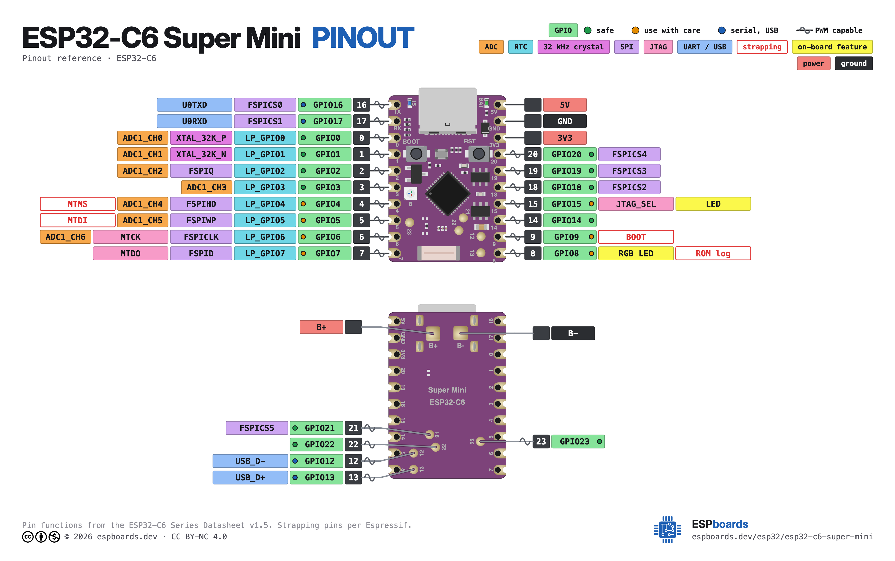

# Remote Wind Monitoring Station — Hardware Design

**Date:** 2026-09-22
**Author:** Coilette (for goos)
**Status:** Draft
**Related:** [power-budget.md](power-budget.md), [storage-budget.md](storage-budget.md)

---

## System Overview

```
  2× ER34615 Li-SOCl2 D-cell (3.6V, 38 Ah total)
       │
       ├──────────────────────────┐ (raw 3.6V)
       │                          │
  ┌────┴─────┐               SIM7080G VBAT
  │ HT7333   │ 3.3V LDO      (LTE-M modem, bulk cap for TX)
  └────┬─────┘ (~1 µA Iq)
       │ 3.3V rail
  ┌────┼──────┬───────┬───────┬───────┬───────┬───────┐
  ▼    ▼      ▼       ▼       ▼       ▼       ▼       ▼
WindNerd ESP32  BME280 DS3231 SD card Piezo  SIM7080G OLED
 Core    C6                            rain   (VCC)   (via
(STM32G0)                                (ADC)         MOSFET)
  │      │
  │      ├─ GPIO1  → trigger → WindNerd
  │      ├─ GPIO4  ← UART RX  ← WindNerd TX2 (9600 baud)
  │      ├─ GPIO0  ← ADC      ← Piezo rain
  │      ├─ GPIO6/7 → I2C → BME280 (0x76) + DS3231 (0x68) + OLED (0x3C) + MCP23008 (0x20)
  │      ├─ GPIO2/3/18/19 → SPI → SD card
  │      ├─ GPIO14 ← MCP23008 INT (encoder + buttons via I2C expander)
  │      ├─ GPIO5  → MOSFET gate → OLED VCC (power gate, firmware-controlled)
  │      ├─ GPIO16/17 → UART0 → SIM7080G (LTE-M uplink)
  │      ├─ GPIO15 → DTR → SIM7080G (PSM sleep/wake control)
  │      ├─ GPIO9  → PWR → SIM7080G (power key, pulse to on/off)
  │      ├─ GPIO20/22/23 → FREE (spare GPIO)
  │      └─ WiFi 6 soft-AP → phone/laptop (data retrieval)
```

**LP core** (5s loop): trigger WindNerd → read UART → buffer in RTC memory
**Main core** (1 min wake): read BME280 + DS3231 + rain ADC → flush buffered data to SD → return to deep sleep
**Main core** (30 min wake): wake SIM7080G from PSM via DTR → MQTT upload buffered data → modem back to PSM → deep sleep
**Main core** (daily): wake SIM7080G → enable GNSS → GPS fix → sync DS3231 RTC → disable GNSS → modem back to PSM → deep sleep
**On demand** (CON button press via MCP23008): wake main core → power on OLED via MOSFET → start WiFi AP → serve CSV files + clock sync → return to low-power mode on timeout or menu action

---

## Netlist

Every net on the platform. Sorted by signal name.

| Net | From | To | Notes |
|-----|------|----|------|
| **3V3** | HT7333 OUT | ESP32-C6 3V3, BME280 VCC, DS3231 VCC, SD VCC, OLED VCC (via Q2), WindNerd VCC, piezo GND ref | Main 3.3V rail |
| **GND** | HT7333 GND | ESP32-C6 GND, BME280 GND, DS3231 GND, SD GND, OLED GND, WindNerd GND, piezo GND, Q1 source, Q2 source, R2 bottom | Common ground |
| **VBAT** | ER34615 + (2 cells parallel) | HT7333 IN | 3.6V nominal, 19 Ah per cell, 38 Ah total |
| **VBAT_GND** | ER34615 − | HT7333 GND | |
| **WIND_TX** | WindNerd TX2 (yellow wire) | ESP32-C6 GPIO4 (LP_UART_RXD) | 9600 baud, 10kΩ pull-up on GPIO4 |
| **WIND_TRIG** | ESP32-C6 GPIO1 (LP core) | WindNerd trigger input | LP core toggles every 5s to wake WindNerd |
| **I2C_SDA** | ESP32-C6 GPIO6 | BME280 SDA, DS3231 SDA, OLED SDA | Shared bus, 0x76 + 0x68 + 0x3C |
| **I2C_SCL** | ESP32-C6 GPIO7 | BME280 SCL, DS3231 SCL, OLED SCL | Shared bus |
| **SPI_SCK** | ESP32-C6 GPIO2 | SD SCK | 10kΩ pull-down (idle low) |
| **SPI_CS** | ESP32-C6 GPIO3 | SD CS | 10kΩ pull-up (idle high) |
| **SPI_MOSI** | ESP32-C6 GPIO18 | SD MOSI | |
| **SPI_MISO** | ESP32-C6 GPIO19 | SD MISO | |
| **RAIN_ADC** | Piezo peak-hold C2 (+) | ESP32-C6 GPIO0 (ADC1_CH0) | Via 10kΩ series resistor R1 |
| **RAIN_RST** | ESP32-C6 GPIO8 | Q1 (2N7002) gate | HIGH 5ms pulse discharges C2. 10kΩ pulldown R2 to GND. |
| **OLED_PWR** | Q2 (AO3401) drain | OLED VCC | P-channel MOSFET switches VCC to OLED |
| **OLED_GATE** | ESP32-C6 GPIO5 | Q2 (AO3401) gate | LOW = OLED on, HIGH = OLED off. 10kΩ pull-up to 3V3. |
| **ENC_A** | EC11 encoder A | MCP23008 GP0 | Rotary encoder clock phase A (via I2C expander) |
| **ENC_B** | EC11 encoder B | MCP23008 GP1 | Rotary encoder data phase B (via I2C expander) |
| **ENC_PSH** | EC11 encoder push | MCP23008 GP2 | Encoder push button, internal pull-up (via I2C expander) |
| **CON_BTN** | CON button → GND | MCP23008 GP3 | Momentary, internal pull-up. UI confirm. INT wakes ESP32 on falling edge. |
| **BAK_BTN** | BAK button → GND | MCP23008 GP4 | Momentary, internal pull-up. UI back / enter sleep. (via I2C expander) |
| **EXP_INT** | MCP23008 INT | ESP32-C6 GPIO14 | Interrupt from I2C expander — wakes ESP32 on any pin change |
| **I2C_SDA** | ESP32-C6 GPIO6 | BME280 SDA, DS3231 SDA, OLED SDA, MCP23008 SDA | Shared bus, 0x76 + 0x68 + 0x3C + 0x20 |
| **I2C_SCL** | ESP32-C6 GPIO7 | BME280 SCL, DS3231 SCL, OLED SCL, MCP23008 SCL | Shared bus |
| **PIEZO+** | Piezo disc + terminal | D1 (1N4148) anode | AC signal from raindrop impacts |
| **PIEZO−** | Piezo disc − terminal | GND | |
| **CPUMP** | D1 cathode | C1 (1nF) top, D2 anode | Voltage doubler midpoint |
| **PEAK** | D2 cathode | C2 (470nF film) top, R1 (10kΩ) → GPIO0 | Peak-hold node — highest impact voltage |
| **CR1220+** | DS3231 BAT+ | CR1220 coin cell + | RTC backup battery |
| **CR1220−** | DS3231 BAT− | CR1220 coin cell − | |
| **SWD_CLK** | ST-Link CLK | WindNerd SWD CLK | Programming only |
| **SWD_DIO** | ST-Link DIO | WindNerd SWD DIO | Programming only |
| **SWD_RST** | ST-Link RST | WindNerd RST | Programming only |
| **SWD_GND** | ST-Link GND | WindNerd GND | Programming only |
| **USB_DP** | ESP32-C6 GPIO12 | USB-C D+ | Native USB programming. Do not use for anything else. |
| **USB_DM** | ESP32-C6 GPIO13 | USB-C D− | Native USB programming. Do not use for anything else. |
| **MODEM_VBAT** | ER34615 + (before LDO) | SIM7080G VBAT (via L1 inductor + C1–C6 bulk/bypass) | Raw battery 3.6V, modem main power. LC filter handles Cat-M1 TX spikes. |
| **MODEM_VCC** | HT7333 OUT (3.3V) | SIM7080G VCC | Logic level reference, 3.3V from LDO rail |
| **MODEM_RXD** | ESP32-C6 GPIO16 (UART0 TX) | SIM7080G RXD | ESP32 TX → modem RX. UART0, 115200 baud. |
| **MODEM_TXD** | SIM7080G TXD | ESP32-C6 GPIO17 (UART0 RX) | Modem TX → ESP32 RX. UART0, 115200 baud. |
| **MODEM_DTR** | ESP32-C6 GPIO15 | SIM7080G DTR | PSM sleep/wake control. HIGH = modem sleeps (PSM), LOW = modem awake. |
| **MODEM_PWR** | ESP32-C6 GPIO9 | SIM7080G PWR | Power key. Pulse LOW ≥1s to power on, pulse LOW ≥1s to power off. |

### Power tree

```
VBAT (3.6V, 38Ah)
  ├─ [L1 1µH] ─ [C1-C6 300µF cap bank] ─ SIM7080G VBAT (LC filter for TX spikes)
  └─ HT7333 LDO (3.3V, ~1µA Iq)
       ├─ ESP32-C6 SuperMini (3V3 pin)
       ├─ WindNerd Core (VCC)
       ├─ BME280 (VCC)
       ├─ DS3231 (VCC)
       ├─ SD card (VCC)
       ├─ SIM7080G VCC (logic level reference, 3.3V)
       ├─ Q2 AO3401 source → OLED VCC (when gated on)
       └─ Piezo circuit (GND reference only — no DC power)
```

---

## Components

### 1. WindNerd Core (wind sensor + MCU)

- **MCU:** STM32G031F8Px (Cortex-M0+, 32KB flash, 8KB RAM)
- **Sensors:** Rotor pulse counting (speed) + TMAG5273 magnetic angle (direction)
- **Output:** USART2 @ 9600 baud, TX2 pin (yellow wire)
- **Input:** GPIO interrupt (our trigger pin)
- **Power:** 3.3V or 5V (onboard regulator accepts either)
- **Programming:** ST-Link V2 (SWD: CLK, DIO, RST, GND) or serial bootloader
- **Current:** ~0.04 mA (custom firmware, STOP mode, on-demand)
- **Source:** [windnerd.net](https://windnerd.net/en/shop) — kit includes board, magnets, bearings
- **3D files:** [windnerd-labs/Anemometer-3D-files](https://github.com/windnerd-labs/Anemometer-3D-files)

### 2. ESP32-C6 SuperMini (datalogger)

- **MCU:** ESP32-C6 (RISC-V single core, 160MHz, LP RISC-V coprocessor)
- **Flash:** 4 MB
- **WiFi:** WiFi 6 (802.11ax)
- **BLE:** BLE 5.3
- **Deep sleep:** ~7 µA (with LP core active)
- **GPIO:** 22 broken out (silkscreen 0–9, 12–15, 16/TX, 17/RX, 18–23) on SuperMini form factor
- **Power:** 3.3V (onboard 3.3V LDO accepts 5V via USB or 3.3V direct)
- **Programming:** USB-C (native USB, no UART adapter needed)

### 3. BME280 (temp / RH / pressure)

- **Interface:** I2C (address 0x76 or 0x77 depending on breakout)
- **Power:** 3.3V
- **Current:** 3.6 µA sleep, 12 mA peak (2ms forced read)
- **Breakout:** Common BME280 modules from Adafruit, Pimoroni, or generic Aliexpress. Any I2C breakout works.
- **Notes:** Needs a radiation shield for accurate temp/RH. Without one, sun heats the sensor and readings are garbage. A simple louvered 3D-printed Stevenson screen works.

### 4. DS3231 (RTC)

- **Interface:** I2C (address 0x68 — no conflict with BME280)
- **Power:** 3.3V (VCC) + CR1220 coin cell (backup)
- **Accuracy:** ±2 ppm (temperature-compensated crystal oscillator)
- **Drift:** ±5 minutes over 6 months (uncorrected)
- **Current:** 0.8 µA (battery-backup mode)
- **Breakout:** Common DS3231 "Tiny RTC" or "Precision RTC" modules. Most include a CR1220 holder.
- **Notes:** Some cheap DS3231 modules ship with a rechargeable LIR2032 battery + charging circuit. **Remove the charging circuit** (cut trace or remove diode) if using a primary CR1220 — charging a non-rechargeable coin cell is a fire hazard.

#### GPS time sync (via SIM7080G GNSS)

The SIM7080G has a built-in GNSS receiver (GPS, GLONASS, Galileo, BeiDou). We use it to periodically sync the DS3231 RTC, eliminating long-term drift:

- **Without sync:** ±2 ppm → ±5 min drift over 6 months. Acceptable but not great for correlating wind events with weather data from other stations.
- **With daily GPS sync:** Drift reset to ±0 every day. Effective accuracy = drift per day ≈ ±0.17s/day (±2 ppm × 86400s). Negligible.
- **Sync schedule:** Once per day (piggyback on a modem wake cycle). GNSS cold fix takes 30–60s, warm fix <5s. Only the first sync is cold; subsequent daily syncs are warm since the modem keeps almanac in RTC memory.
- **Power cost:** GNSS active current ~60–100 mA for ~30–60s once per day. Averaged: 100mA × 45s / 86400s = **~0.052 mA** added to the daily average. Negligible — adds 0.14 Ah over 6 months.
- **Firmware flow:** Main core wakes modem (DTR LOW) → AT+CGNSPWR=1 (enable GNSS) → wait for fix (AT+CGNSINF, poll until valid) → parse UTC time → write to DS3231 via I2C → AT+CGNSPWR=0 (disable GNSS) → modem back to PSM.
- **Antenna:** GNSS uses a separate antenna from LTE. The SIM7080G breakout should have a GNSS antenna pad (usually labeled GNSS or GPS). A small passive patch antenna (25×25mm, ~$2) mounted with sky view is sufficient. Active antennas draw ~10–20 mA continuously — avoid for battery operation; we only enable GNSS for 60s/day.
- **Fallback:** If GPS fix fails (heavy overcast, snow cover on antenna, indoor test), DS3231 continues on its own. Next day's sync attempt catches up. No data loss — timestamps just drift slightly until next successful fix.
- **CR1220 backup:** Still needed. The DS3231's coin cell keeps time during the gap between manufacturing/programming and first deployment, and during any extended GNSS outage. The coin cell is the always-on clock; GPS is the correction.

### 5. Piezo Rain Sensor — DIY Disdrometer

- **Interface:** Analog voltage (ADC, GPIO0)
- **Power:** 3.3V (passive — piezo generates its own voltage, no power needed except op-amp if used)
- **Type:** Piezoelectric disc impact disdrometer (no moving parts)
- **Cost:** ~$2-5

#### How it works

A piezo disc is bonded to the underside of a flat rigid plate (acrylic, polycarbonate, or thin PCB). Raindrops hit the plate, transferring kinetic energy through the plate to the piezo, which generates a voltage spike proportional to the impact force. Bigger drops = bigger spikes. More drops per second = higher rain rate.

The piezo signal is bipolar AC (mV to several volts). A simple conditioning circuit biases it to VCC/2, clamps the peaks to protect the ADC, and optionally a peak detector holds the maximum between samples.

#### Signal conditioning circuit (v1 — passive peak-hold with voltage doubler)

```
              D1 (1N4148)
  Piezo ──┬──→|──┬──────────┐
   (+/-)  │      │          │
          │   C1  │  D2     │
          │   1nF │ (1N4148)│
          │      │  ┌──→|──┬─┴── 10kΩ ── GPIO0 (ADC)
          │      └──┘      │
          │               C2
          │            470nF film
          │               │
          │          ┌────┴────┐
          │          │ 2N7002  │  gate → GPIO8 (reset)
          │          └────┬────┘  10kΩ pulldown on gate
          │               │
  Piezo ──┴───────────────┴── GND
```

**How it works:**

- D1 + C1 form a charge pump (Greinacher voltage doubler) — captures both AC half-cycles from the piezo and doubles the peak voltage onto C2
- D2 is the peak-hold diode — C2 charges to the highest impact voltage seen since last reset
- C2 (470nF film) holds the peak — film dielectric for negligible self-leakage (hours)
- 2N7002 N-MOSFET on GPIO8 discharges C2 after each ADC read — 5ms pulse to reset, clean window for next interval
- 10kΩ on ADC input is series protection, not a bleed — the only discharge paths are 1N4148 reverse leakage (~5nA) and ADC sampling
- 10kΩ pulldown on MOSFET gate ensures it stays OFF during deep sleep (gate = 0V)

**Why no Schottky diodes:** 1N4148 has higher forward drop (0.7V vs 0.3V) but much lower reverse leakage (~5nA vs ~2µA). The piezo produces 5-20V open-circuit, so 0.7V forward drop is irrelevant. Lower leakage is critical — it's what lets us use a small hold cap (470nF) and still retain the peak across 60s.

**Why no bleed resistor:** With MOSFET reset, the bleed resistor is an intentional leakage path that wastes signal. Removed. The MOSFET is the controlled discharge path.

**Why voltage doubler:** The piezo output is AC. A single diode throws away half the energy. The doubler captures both half-cycles for ~2× signal — free improvement, one extra diode + cap.

**Signal levels (estimated):**

| Drop size | Charge (approx) | Voltage on C2 (doubled) | After 60s hold (5nA leak) |
|-----------|-----------------|------------------------|--------------------------|
| Light drizzle | ~50nC | ~210mV | ~146mV ✅ |
| Moderate | ~150nC | ~640mV | ~576mV ✅ |
| Heavy | ~300nC | ~1.28V | ~1.21V ✅ |

ESP32-C6 ADC: 12-bit, 0-3.3V → 0.8mV resolution. Light drizzle (~146mV after hold) = ~182 ADC counts — well above noise floor.

**BOM:**

| Ref | Part | Value | Cost |
|-----|------|-------|------|
| D1, D2 | 1N4148 | signal diode | ~$0.02 |
| C1 | 1nF ceramic | charge pump | ~$0.01 |
| C2 | 470nF film | hold cap (low leakage) | ~$0.10 |
| Q1 | 2N7002 | N-MOSFET reset | ~$0.03 |
| R1 | 10kΩ | ADC series protection | ~$0.01 |
| R2 | 10kΩ | MOSFET gate pulldown | ~$0.01 |
| **Total** | | | **~$0.20** |

**Firmware:** Main core reads ADC as burst (16 reads, take max), then pulses GPIO8 HIGH for 5ms to discharge C2. Read happens on 1-minute wake cycle. The peak-hold circuit captures the highest raindrop impact across the full 60s window.

#### Signal conditioning circuit (v2 — with op-amp, if v1 lacks sensitivity)

```
Piezo disc ──┬── 1N4148 clamps (to GND and 3.3V)
            └── OPA376 (gain = 10×, 0.9 µA quiescent)
                 └── Peak detector (1N4148 + 10nF cap + 10MΩ bleed)
                      └── ADC input (GPIO0)
```

OPA376: 0.9 µA quiescent, rail-to-rail, $1.50. Gain of 10× brings mV-level drizzle signals into the ADC's usable range. Peak detector holds the max impact voltage between 5s samples.

#### Catch surface design

- **Material:** 3mm acrylic (PMMA), 60mm diameter — precut discs widely available, cheaper than polycarbonate, UV-stable. Stiffer than polycarbonate (sharper impact peaks) but won't shatter like glass. Some ringing after impact but less than glass — acceptable for v1.
- **Piezo:** 35mm passive piezo disc element (brass + ceramic, no driver circuit, ~$0.50)
- **Mounting:** Piezo bonded to center of plate underside with epoxy. 12.5mm rim around piezo for bonding + mounting. Disc mounted level, exposed to sky.
- **Drainage:** Slight tilt or textured surface so water doesn't pool. Pooling dampens the signal.
- **Catch area:** 28 cm² (60mm diameter) — slightly above the 20 cm² literature sweet spot. Large enough to catch drops, small enough that simultaneous impacts rarely overlap even in heavy rain.
- **Piezo size rationale:** 35mm chosen over 27mm for higher sensitivity (~2× capacitance → higher voltage per impact). Important for v1 with no op-amp — need maximum raw signal for light rain detection. 27mm is the fallback if 35mm is unavailable.
- **Plate size rationale:** 60mm chosen over 50mm to give adequate rim space (12.5mm) for epoxy bonding around a 35mm piezo. 50mm would leave only 7.5mm rim — tight for reliable bonding.
- **Material rationale:** Acrylic chosen over polycarbonate (cheaper precuts, UV-stable, stiffer = sharper peaks) and glass (shatters in hail). Aluminum disc (0.5mm) is the acoustic upgrade path if signal quality needs improvement.

#### Calibration

Piezo output is not in mm/hr — it's a raw voltage/impact count. Calibration maps the signal to rain rate. Several approaches from the literature:

1. **Simple threshold counting:** Count ADC peaks above a threshold per interval. More peaks = more rain. Crude but functional. Calibrate against a reference gauge by finding the threshold and scaling factor that matches.

2. **Peak amplitude integration:** Sum (or average) the peak amplitudes per interval. Higher amplitude = bigger drops = more rain. Better correlation with rain rate than pure count.

3. **ML-based calibration:** Train a model (random forest, etc.) on features extracted from the signal (peak count, peak amplitude distribution, RMS energy, frequency content) against a reference rain gauge. Best accuracy per the research literature.

4. **Field calibration:** Deploy alongside a known reference (tipping bucket, manual gauge, or nearby weather station) for a few rain events. Correlate raw piezo data with known rain rates. Derive a calibration curve. Apply retroactively to the full dataset.

For v1: **log raw ADC peak values** (peak amplitude per 5s interval). Calibrate later against a reference. The raw data is preserved — any calibration method can be applied retroactively.

#### Reference designs and literature

| Source | What it provides | Link |
|---|---|---|
| **Delft University disdrometer** | Full DIY build guide with circuit, firmware, and calibration approach. Instructables with photos and code. | [instructables.com](https://www.instructables.com/Make-an-acoustic-rain-gauge-disdrometer/) |
| **IOPScience — piezo-buzzer disdrometer** | Academic paper with full circuit (sensor → op-amp → filter → ADC), Arduino firmware, and calibration against a reference gauge. Uses DS3231 RTC (same as us!). | [iopscience.iop.org](https://iopscience.iop.org/article/10.1088/1742-6596/2034/1/012023/pdf) |
| **MDPI — ML calibration paper** | Low-cost piezo sensor with ML-based calibration. Extracts signal features and trains models against reference rain gauge data. Best accuracy approach. | [mdpi.com](https://www.mdpi.com/1424-8220/22/17/6638) |
| **Ravi Bagree thesis** | Detailed readout circuit characterization for piezo disdrometer. Covers impedance matching, gain stages, and noise analysis. | [scribd.com](https://www.scribd.com/document/273071512/) |
| **ICFOSS Acoustic Raingauge** | Open source GitHub project. Uses acoustic sensors + ML to estimate precipitation. Python analysis scripts included. | [github.com/harikrishnan-kp/Acoustic_Raingauge](https://github.com/harikrishnan-kp/Acoustic_Raingauge) |
| **Analog Devices CN-0350** | Charge-mode piezo sensor ADC reference design. Industrial-grade signal chain for piezoelectric sensors. Overkill but good theory. | [analog.com](https://www.analog.com/media/en/reference-design-documentation/reference-designs/CN0350.pdf) |
| **"Affordable Acoustic Disdrometer" paper** | Design, calibration, and field tests of a low-cost piezo disdrometer. 20 cm² catch area, validates the approach. | [researchgate.net](https://www.researchgate.net/publication/241375116_Affordable_Acoustic_Disdrometer_Design_Calibration_Tests) |

#### Power

| Component | Current | Notes |
|---|---|---|
| Piezo disc (passive) | 0 µA | Generates its own voltage, no power needed |
| Peak-hold circuit (passive) | ~0 µA | 1N4148 leakage ~5nA, film cap self-discharge negligible. No DC path to VCC. |
| 2N7002 gate pulldown | 0 µA | Gate held LOW in sleep, no current flow |
| Op-amp (OPA376, if used in v2) | 0.9 µA | Only needed for v2 with amplification |
| **Total (v1, peak-hold)** | **~0 µA** | Negligible — no bias divider needed |
| **Total (v2, with op-amp)** | **~1.1 µA** | Still negligible |

### 6. SIM7080G (LTE-M modem uplink)

- **Module:** SIMCom SIM7080G (Cat-M1 + NB-IoT, LGA)
- **Breakout:** Ordered by goos — 8-pin breakout with VBAT, GND, VCC, GND, RXD, TXD, DTR, PWR
- **LTE class:** Cat-M1 (eMTC) — AT&T's committed IoT technology
- **Max downlink/uplink:** 0.3 / 0.37 Mbps (Cat-M1)
- **Sleep current (PSM):** ~3 µA (module only), ~10–50 µA realistic board-level
- **Active current:** ~200–600 mA TX bursts (Cat-M1)
- **Bands (global G variant):** B1, B2, B3, B4, B5, B8, B12, B13, B18, B19, B20, B25, B26, B27, B28, B66, B71, B85
- **AT&T bands:** B2, B4, B5, B12, B17 (via B12), B66, B71
- **GNSS:** GPS, GLONASS, Galileo, BeiDou — used for daily RTC sync (see below)
- **Host interface:** UART (115200 baud, AT commands)
- **SIM voltage:** 1.8 V only — need 1.8 V-compatible IoT SIM
- **Power supply:** VBAT pin takes raw battery voltage (3.6V Li-SOCl2), VCC pin takes 3.3V logic reference from LDO
- **Antenna:** External directional Yagi (700 MHz primary), SMA connector on breakout
- **PSM (Power Saving Mode):** Modem stays registered to network while sleeping at ~3 µA. Wake via DTR LOW, upload data, sleep via DTR HIGH. Reconnection takes seconds, not 30–60s cold attach.
- **See:** [lte-uplink.md](lte-uplink.md) for full modem analysis, antenna selection, SIM plan, and power budget

#### Pin mapping (modem breakout → ESP32-C6)

| Modem pin | ESP32-C6 pin | Function | Notes |
|---|---|---|---|
| VBAT | Raw battery (before LDO) | Modem main power | 3.6V from Li-SOCl2. LC filter (L1 1µH + 3× 100µF ceramic) for Cat-M1 TX spikes. |
| GND | GND | Ground | 2× GND pins on breakout, tie both to common ground |
| VCC | 3.3V LDO output | Logic level reference | 3.3V from HT7333 rail. Powers level shifters / reference on breakout. |
| RXD | GPIO16 (UART0 TX) | ESP32 → modem | 115200 baud, AT commands |
| TXD | GPIO17 (UART0 RX) | Modem → ESP32 | 115200 baud, AT responses |
| DTR | GPIO15 | PSM sleep/wake | HIGH = modem sleeps (PSM), LOW = modem awake. 10kΩ pull-up = sleeps during boot. |
| PWR | GPIO9 | Power key | Pulse LOW ≥1s to toggle power on/off. 10kΩ pull-up (boot-safe). |

#### Power supply notes

The SIM7080G's VBAT pin draws directly from the Li-SOCl2 battery (before the LDO) because:
1. **Cat-M1 TX spikes hit 600 mA** — the HT7333 LDO is rated for 250 mA max
2. **Li-SOCl2 D-cells can deliver ~100 mA continuous** but Cat-M1 TX is duty-cycled (short bursts)
3. An **LC filter** (L1 1µH inductor + 3× 100µF ceramic caps) on VBAT handles the TX current spikes; the battery provides the average current
4. The LDO output (3.3V, 250 mA) powers VCC (logic reference) which draws only mA-level current

**VBAT power filtering — LC filter + bulk capacitance**

Li-SOCl2 batteries have high internal resistance (~10–50Ω per cell, 5–25Ω with 2 cells in parallel). Cat-M1 TX bursts hit ~600 mA for ~0.5ms, repeating every ~20ms during active transmission. Without filtering, VBAT sags below the modem's 3.4V minimum and the modem resets.

SIMCom's hardware design guide recommends an LC filter on VBAT — this is the standard approach for all SIMCom LTE modems:

```
  Battery + ──[ L1 ] ──┬── VBAT (modem)
                      │
              ┌───────┼───────┬───────┐
              │       │       │       │
           C1 100µF  C2 100µF C3 100µF C4 10µF
            (ceramic) (ceramic) (ceramic) (ceramic)
              │       │       │       │
              └───────┼───────┴───────┘
                      │
                   C5 100nF  C6 33pF
                   (ceramic) (ceramic)
                      │
  Battery − ──────────┴── GND
```

**Why an inductor (L1) instead of just a resistor:**
- A resistor would limit current but waste power continuously (I²R loss at the modem's ~50 mA active current)
- An inductor has near-zero DC resistance (DCR < 0.1Ω) — negligible steady-state loss
- During TX spikes, the inductor's impedance (ZL = 2πfL) blocks high-frequency current from reaching back to the battery — the cap bank supplies the burst instead
- Between bursts, the inductor lets the cap recharge from the battery at a sustainable rate (~50–100 mA, well within Li-SOCl2 capability)

**Why three 100µF caps instead of one 330µF:**
- ESR (equivalent series resistance): three 100µF ceramics in parallel ≈ 1.7mΩ total. One 330µF electrolytic ≈ 100–300mΩ. Low ESR is what delivers the multi-amp spike current without voltage droop.
- ESL (equivalent series inductance): parallel ceramics have lower ESL than a single large cap — better high-frequency response.
- Ceramic caps also have vastly better cold-temperature performance than electrolytics (ESR stays low at -40°C, electrolytic ESR can 10× at cold).

**Component values:**

| Ref | Part | Value | Notes |
|---|---|---|---|
| L1 | Power inductor or ferrite bead | 1–2.2 µH, DCR < 0.1Ω, saturation current ≥ 2A | SMD (e.g. 0805/1206). Low DCR critical — higher DCR wastes power. Saturation current must exceed worst-case TX spike. |
| C1–C3 | Ceramic cap, X5R/X7R | 3× 100µF, 6.3V+, 0805/1206 | X7R for cold temp stability. Parallel for low ESR/ESL. Place as close to VBAT pins as possible. |
| C4 | Ceramic cap, X7R | 10µF, 6.3V, 0603 | Mid-frequency bypass |
| C5 | Ceramic cap, X7R | 100nF, 0402 | High-frequency bypass |
| C6 | Ceramic cap, C0G/NP0 | 33pF, 0402 | RF noise bypass (near VBAT pins) |
| TVS | TVS diode (optional) | ~5V standoff, SMA/SMB | ESD protection on VBAT per SIMCom recommendation |

**Energy budget check:**

- Energy stored in 300µF cap bank at 3.6V: E = ½CV² = ½ × 0.0003 × 3.6² = **1.94 mJ**
- Energy per Cat-M1 TX burst (600 mA × 3.6V × 0.5ms): E = V×I×t = 3.6 × 0.6 × 0.0005 = **1.08 mJ**
- Cap bank has 1.8× the energy for a single burst. With the inductor limiting recharge rate, the cap bank handles 1–2 bursts before needing recharge. Cat-M1 typically bursts every 20ms during a ~30s active period — the cap recharges between bursts via the inductor at ~50 mA (battery's safe continuous rate), which is enough to sustain the duty cycle.

**Alternative: pre-built LC filter module**

Pre-built power filter modules (e.g. "LC power filter module" from Amazon/AliExpress, ~$2–5) bundle an inductor + caps in a tiny PCB. These work but check:
- Inductor saturation current (must be ≥ 2A for Cat-M1)
- Cap values and type (must be ceramic, not electrolytic, for low ESR at cold)
- DCR of the inductor (must be < 0.1Ω to avoid wasting power in sleep)

A DIY SMD build on a small breakout is better — you control the component quality and can tune values. But a pre-built module is fine for prototyping.

**What the breakout board may already include:**

The SIM7080G breakout goos ordered may already have some VBAT decoupling on the PCB. Check the breakout board's BOM before duplicating. If it has 100µF+ on VBAT, add only the inductor (L1) in series between the battery and the breakout's VBAT input. If it has minimal decoupling, add the full LC filter externally.

**Updated power tree with LC filter:**

```
VBAT (3.6V, 38Ah)
  ├─ [L1 1µH] ── [C1-C6 bulk/bypass] ── SIM7080G VBAT
  └─ HT7333 LDO (3.3V, ~1µA Iq)
       ├─ ESP32-C6 SuperMini (3V3 pin)
       ├─ WindNerd Core (VCC)
       ├─ BME280 (VCC)
       ├─ DS3231 (VCC)
       ├─ SD card (VCC)
       ├─ SIM7080G VCC (logic level reference, 3.3V)
       ├─ Q2 AO3401 source → OLED VCC (when gated on)
       └─ Piezo circuit (GND reference only — no DC power)
```

### 7. MCP23008 (I2C GPIO Expander)

- **Chip:** MCP23008 — 8-bit I2C expander with interrupt output
- **I2C address:** 0x20 (A0=A1=A2=GND) — no conflict with BME280 (0x76), DS3231 (0x68), OLED (0x3C)
- **Voltage:** 3.3V (VCC from LDO rail)
- **Standby current:** ~1 µA
- **Internal pull-ups:** 100kΩ per pin — no external resistor bank needed for buttons
- **Interrupt:** Active-low INT output → ESP32-C6 GPIO14. Wakes ESP32 on any pin change.
- **Breakout:** Common MCP23008 breakout boards from Adafruit, SparkFun, or generic AliExpress. 8-pin SIP, 2.54mm pitch.

#### Pin mapping (MCP23008 → OLED/encoder board)

| MCP23008 pin | Function | Notes |
|---|---|---|
| GP0 | ENC_A (encoder clock) | Input, pull-up via expander |
| GP1 | ENC_B (encoder data) | Input, pull-up via expander |
| GP2 | ENC_PSH (encoder push) | Input, pull-up via expander |
| GP3 | CON_BTN (confirm) | Input, pull-up via expander. INT wakes ESP32 on falling edge. |
| GP4 | BAK_BTN (back/sleep) | Input, pull-up via expander |
| GP5 | spare | Available for future expansion |
| GP6 | spare | Available for future expansion |
| GP7 | spare | Available for future expansion |
| INT | → ESP32-C6 GPIO14 | Active-low interrupt output |
| SDA | ESP32-C6 GPIO6 | Shared I2C bus |
| SCL | ESP32-C6 GPIO7 | Shared I2C bus |
| VCC | 3.3V LDO | |
| GND | GND | |

#### Why MCP23008 over PCF8574

- **Per-pin direction control:** PCF8574 is quasi-bidirectional only — can't mix inputs and outputs cleanly
- **Internal pull-ups:** MCP23008 has 100kΩ pull-ups per pin — saves 5× external resistors for buttons
- **Proper interrupt output:** MCP23008 has a dedicated INT pin with configurable polarity (active-low by default). PCF8574's interrupt is less flexible.
- **Lower standby:** MCP23008 ~1 µA vs PCF8574 ~3-5 µA

#### Encoder over I2C latency

Manual encoder rotation produces ~10-20 detents/sec, each transition 50-100ms apart. I2C reads the port register in ~100µs. The INT fires on any pin change, ESP32 wakes (~3ms), reads state over I2C, processes, returns to sleep. Total latency ~5ms per event — imperceptible to a human. Only used during interactive mode anyway (OLED on, user physically present).

### 8. MicroSD Card Module

#### Does the chipset matter?

**No.** SD card modules are dumb SPI-to-SD-card adapters. The "chipset" is just a level shifter (or not) and an SD card slot. The ESP32-C6 handles all SD protocol in firmware via SPI.

What matters:

| Factor | Why it matters |
|---|---|
| **Voltage** | Must be 3.3V logic. Some cheap modules have a 5V→3.3V LDO + level shifter (the "CATALEX" style). These work but waste power in the LDO. A bare 3.3V SPI microSD breakout is better for low power. |
| **SPI vs SDIO** | SPI mode uses 4 pins (MOSI, MISO, SCK, CS). SDIO mode uses 6 pins but is faster. We don't need speed — SPI is fine and saves 2 pins. |
| **Slot quality** | Cheap modules have flaky card slots. A proper spring-loaded microSD holder matters for 6 months of vibration/wind. |
| **No onboard LED** | Some modules have a power LED. Desolder it — wastes ~1 mA constantly. |

#### Recommended module

**Bare SPI microSD breakout (3.3V, no level shifter, no LED).**

Common options:
- **Adafruit microSD SPI breakout** — $4.95, clean 3.3V design, no LED, reliable slot
- **SparkFun microSD Transflash breakout** — similar
- **Generic "microSD SPI module" (no LDO version)** — $1-2 on Aliexpress. Look for ones without the AMS1117 LDO chip. If it has an LDO, it's the 5V-compatible version — works but wastes power.

**Key:** Get one that's 3.3V-only (no LDO, no level shifter). The ESP32-C6 is 3.3V logic — direct SPI is cleanest and lowest power.

#### Wiring

| SD pin | ESP32-C6 GPIO | Notes |
|---|---|---|
| VCC (3.3V) | 3.3V | Direct from ESP32-C6 3.3V rail |
| GND | GND | |
| MOSI | GPIO assigned | SPI MOSI |
| MISO | GPIO assigned | SPI MISO |
| SCK | GPIO assigned | SPI clock |
| CS | GPIO assigned | Chip select (active low) |

#### SD card

- **Capacity:** 8 GB (we need ~168 MB for 6 months — 8 GB has 47× headroom)
- **Type:** Industrial pSLC for cold + power-loss resilience
- **Recommended:** Transcend Industrial 8GB (-40°C) or SanDisk High Endurance 32GB
- **Format:** FAT32 (8 GB or smaller) or exFAT (larger). FAT32 is simpler and well-supported on ESP32.

---

## Pin Allocation — ESP32-C6 SuperMini


> esp32-c6 supermini from <https://www.espboards.dev/esp32/esp32-c6-super-mini/#pinout>

The ESP32-C6 SuperMini breaks out **22 GPIO** with silkscreen labels 0–9, 12–15, 16(TX), 17(RX), 18–23. GPIO10 and GPIO11 are **not broken out** — internal flash pins.

**Board layout** (USB port facing up):

| Left side | → | Right side |
|---|---|---|
| 16, 17, 0, 1, 2, 3, 4, 5, 6, 7, 23, 22 | | 5V, GND, 3V3, 20, 19, 18, 15, 14, 9, 8, 12, 13, 21 |

**Safe pins** (no boot/system duties): 0, 1, 2, 3, 14, 18, 19, 20, 21, 22, 23
**Strapping pins**: 2, 4, 5, 6, 7, 8, 9, 15
**UART0**: 16 (TX), 17 (RX) — free if using native USB for programming
**USB**: 12 (D−), 13 (D+) — do not use
**Onboard LEDs**: 8 (WS2812 RGB), 15 (status LED) — keep off in firmware for low power

| Silkscreen | GPIO | Function | Core | Pin status | Capabilities | Notes |
|---|---|---|---|---|---|---|
| 0 | GPIO0 | **ADC — piezo rain** | LP core | safe | ADC1_CH0, LP_GPIO0 | LP core reads ADC at 5s. Low-noise analog pin. |
| 1 | GPIO1 | **WindNerd trigger (output)** | LP core | safe | ADC1_CH1, LP_GPIO1 | LP core toggles every 5s to wake WindNerd |
| 2 | GPIO2 | **SPI SCK (SD card)** | Main core | strapping | ADC1_CH2, LP_GPIO2, FSPIQ | SD card clock. SPI clock idles low — 10kΩ pull-down keeps boot-safe. |
| 3 | GPIO3 | **SPI CS (SD card)** | Main core | safe | ADC1_CH3, LP_GPIO3 | SD card chip select (active low). 10kΩ pull-up keeps CS high during boot. |
| 4 | GPIO4 | **UART RX from WindNerd** | LP core | strapping | ADC1_CH4, LP_GPIO4, LP_UART_RXD, MTMS | LP_UART RX. UART idles high — 10kΩ pull-up keeps boot-safe. |
| 5 | GPIO5 | **OLED VCC MOSFET gate** | Main core | strapping | ADC1_CH5, LP_GPIO5, LP_UART_TXD, MTDI | P-channel MOSFET gate. 10kΩ pull-up = OFF during boot. LOW = OLED on. |
| 6 | GPIO6 | **I2C SDA (BME280 + DS3231 + OLED)** | Main core | strapping | ADC1_CH6, LP_GPIO6, MTCK, FSPICLK | Shared I2C bus, three devices (0x76, 0x68, 0x3C) |
| 7 | GPIO7 | **I2C SCL (BME280 + DS3231 + OLED)** | Main core | strapping | LP_GPIO7, MTDO, FSPID | Shared I2C bus |
| 8 | GPIO8 | **Rain peak-hold reset (2N7002 gate)** | Main core | strapping | WS2812 RGB LED | Pulses HIGH 5ms to discharge 470nF hold cap after ADC read. 10kΩ pulldown = OFF during sleep. Onboard RGB LED stays OFF. |
| 9 | GPIO9 | **SIM7080G PWR (power key)** | Main core | strapping | BOOT button | Pulse LOW ≥1s to power modem on/off. 10kΩ pull-up (boot-safe). |
| 12 | GPIO12 | — RESERVED | — | USB | USB_D− | Native USB (programming). Do not use. |
| 13 | GPIO13 | — RESERVED | — | USB | USB_D+ | Native USB (programming). Do not use. |
| 14 | GPIO14 | **MCP23008 INT (I2C expander interrupt)** | Main core | safe | General purpose | Interrupt from MCP23008 — wakes ESP32 on encoder/button pin change |
| 15 | GPIO15 | **SIM7080G DTR (PSM control)** | Main core | strapping | JTAG, LED | HIGH = modem sleeps (PSM), LOW = modem awake. 10kΩ pull-up = modem sleeps during boot. |
| 16 (TX) | GPIO16 | **SIM7080G RXD (UART0 TX)** | Main core | uart | UART0 TX, FSPICS0 | ESP32 TX → modem RX. 115200 baud. Native USB used for programming, UART0 free for modem. |
| 17 (RX) | GPIO17 | **SIM7080G TXD (UART0 RX)** | Main core | uart | UART0 RX, FSPICS1 | Modem TX → ESP32 RX. 115200 baud. |
| 18 | GPIO18 | **SPI MOSI (SD card)** | Main core | safe | SDIO CMD, FSPICS2 | SD card data out |
| 19 | GPIO19 | **SPI MISO (SD card)** | Main core | safe | SDIO CLK, FSPICS3, I2C SCL (alt) | SD card data in |
| 20 | GPIO20 | **FREE** | — | safe | SDIO DATA0, FSPICS4, I2C SDA (alt) | Spare — freed by moving encoder to MCP23008 |
| 22 | GPIO22 | **FREE** | — | safe | SDIO DATA2 | Spare — freed by moving CON button to MCP23008 |
| 23 | GPIO23 | **FREE** | — | safe | SDIO DATA3 | Spare — freed by moving BAK button to MCP23008 |

**Summary:**

| Category | Count | Silkscreen pins |
|---|---|---|
| Used (LP core) | 3 | 0 (ADC), 1 (trigger), 4 (UART RX) |
| Used (main core) | 13 | 2 (SCK), 3 (CS), 5 (MOSFET), 6 (SDA), 7 (SCL), 8 (rain reset), 9 (modem PWR), 14 (expander INT), 15 (modem DTR), 16 (modem TX), 17 (modem RX), 18 (MOSI), 19 (MISO) |
| Reserved (USB) | 2 | 12, 13 |
| **Free** | **3** | 20, 22, 23 |

**3 free GPIO** (IO20, IO22, IO23). Encoder + buttons moved to MCP23008 I2C expander (address 0x20) on shared I2C bus. MCP23008 INT → GPIO14 wakes ESP32 on any pin change. GPIO10/GPIO11 don't exist on this board. GPIO21 does not exist as a pad on the SuperMini board.

### Pin assignment rationale

- **LP core pins (0–4):** The LP RISC-V core can only access LP_GPIO0–7. We use pin 0 for ADC (piezo), pin 1 for trigger output, and pin 4 for LP_UART RX. All three are LP-accessible.
- **LP_UART on pin 4:** The ESP32-C6's LP_UART defaults to GPIO4 (RXD) and GPIO5 (TXD). We only need RX (WindNerd sends data, we don't send back). Pin 4 is a strapping pin (MTMS) but UART idles high, so a 10kΩ pull-up keeps it boot-safe.
- **I2C on pins 6/7:** Shared I2C bus with three devices: BME280 (0x76), DS3231 (0x68), SH1106 OLED (0x3C). No address conflicts. These are the LP_I2C default pins but we use them with the main core's I2C peripheral.
- **SPI on pins 2/3/18/19:** SPI is remapped via GPIO matrix. Pins 2/3 are on the left header, pins 18/19 on the right header. All avoid USB and are safe/low-conflict. Pins 10/11 do not exist on this board. We deliberately choose SPI mode (4 pins) over SDIO mode (6 pins) because the data rate is trivial (~838 KB/day, 70-byte appends once per minute). SDIO's speed advantage is irrelevant when the SD card is asleep 55s out of every 60s.
- **ADC on pin 0:** ADC1_CH0, lowest-conflict ADC pin. LP core reads it at 5s intervals.
- **OLED on shared I2C:** SH1106 1.3" OLED shares the pin 6/7 I2C bus. Address 0x3C — no conflict. Display is power-gated by P-channel MOSFET (AO3401), gate on GPIO5 (firmware-controlled, not tied to a switch). 10kΩ pull-up on gate keeps MOSFET off during boot/deep sleep. Zero current when off.
- **Rotary encoder + buttons on MCP23008 I2C expander:** EC11 encoder (TRA/TRB/PSH) and CON/BAK buttons all connect to an MCP23008 8-bit I2C expander at address 0x20. The expander's INT output connects to GPIO14 on the ESP32-C6, which wakes the main core on any pin change. This frees GPIO20, GPIO22, and GPIO23 for future use, and solves the GPIO21 problem (that pad doesn't exist on the SuperMini board). MCP23008 has internal pull-ups, so no external resistor bank needed for the buttons. Standby current ~1 µA — negligible in the power budget.
- **CON button on MCP23008 GP3:** Momentary button to GND with internal pull-up. CONFIRM button in interactive UI. INT wakes ESP32 on falling edge.
- **BAK button on MCP23008 GP4:** Momentary button to GND with internal pull-up. BACK button in interactive UI. At top-level menu, pressing BAK returns the station to low-power mode (power off OLED, stop WiFi, enter deep sleep).
- **OLED MOSFET gate on pin 5:** GPIO5 drives the P-channel MOSFET gate for OLED power gating. HIGH = OLED off (pull-up ensures off during boot), LOW = OLED on. GPIO5 is strapping (MTDI) but 10kΩ pull-up = HIGH during boot = normal boot mode. Safe.
- **Exit interactive mode:** 60s inactivity timeout (auto-sleep), or explicit "Sleep" menu option (navigate with encoder, confirm with CON), or press BAK at top-level menu. A separate "Halt" option (full system stop, requires power cycle) may be added in a future revision.
- **Onboard LEDs:** Pin 8 (WS2812 RGB) and pin 15 (status LED) have onboard LEDs. Both are strapping pins and left free. Firmware must keep them OFF — the WS2812 draws ~1 mA even when showing black. Desolder the RGB LED if it causes sleep current issues.

### Deep sleep current note

Per [measurements on this exact board](https://dmelo.eu/blog/esp32c6_deepsleep/), deep sleep current is in the **tens of microamps** — higher than the ESP32-C6 datasheet's bare-module figure of ~7 µA. The onboard LTH7R charger IC and passive components add overhead. Our power budget estimate (~0.018 mA for ESP32-C6) may be optimistic by 2-5×. **Plan to measure actual sleep current on the specific board** and update the power budget accordingly. Desoldering the RGB LED (pin 8) and status LED (pin 15) may help reduce sleep current.

---

## Inter-board Wiring

### WindNerd Core ↔ ESP32-C6

| WindNerd pin | ESP32-C6 pin | Wire color | Function |
|---|---|---|---|
| TX2 (yellow) | GPIO4 (LP_UART RX) | Yellow | Wind data output → ESP32-C6 LP core reads |
| GND | GND | Black | Common ground |
| GPIO (trigger) | GPIO1 | Green | ESP32-C6 LP core triggers WindNerd read |
| VCC | 3.3V (LDO) | Red | WindNerd powered from shared 3.3V LDO rail |

**Notes:**
- UART is one-way (WindNerd TX → ESP32-C6 RX). No need for RX on WindNerd — the trigger is a separate GPIO, not UART.
- Pull-up resistor (10kΩ) on the trigger line — keeps WindNerd's GPIO stable during ESP32 deep sleep.
- UART line: 9600 baud, short distance (inside enclosure, ~10cm). No level shifter needed — both are 3.3V logic.

### BME280 ↔ ESP32-C6

| BME280 pin | ESP32-C6 pin | Notes |
|---|---|---|
| VCC (3.3V) | 3.3V (LDO) | |
| GND | GND | |
| SDA | GPIO6 (I2C SDA) | Shared with DS3231 |
| SCL | GPIO7 (I2C SCL) | Shared with DS3231 |

### DS3231 ↔ ESP32-C6

| DS3231 pin | ESP32-C6 pin | Notes |
|---|---|---|
| VCC (3.3V) | 3.3V (LDO) | |
| GND | GND | |
| SDA | GPIO6 (I2C SDA) | Shared with BME280 + OLED |
| SCL | GPIO7 (I2C SCL) | Shared with BME280 + OLED |
| CR1220+ | — | Backup battery on DS3231 module |

### OLED + Rotary Encoder + Buttons Board ↔ ESP32-C6

The OLED+encoder board combines a 1.3" SH1106 OLED, EC11 rotary encoder, and two pushbuttons (CONFIRM and BACK) on a single breakout. Board pinout:

```
CON  SDA  SCL  PSH  TRA  TRB  BAK  GND  VCC
```

| Board pin | Connects to | Notes |
|---|---|---|
| CON | MCP23008 GP3 | CONFIRM button — internal pull-up, INT wakes ESP32 |
| SDA | ESP32-C6 GPIO6 (I2C SDA) | Shared bus (BME280 0x76 + DS3231 0x68 + OLED 0x3C + MCP23008 0x20) |
| SCL | ESP32-C6 GPIO7 (I2C SCL) | Shared bus |
| PSH | MCP23008 GP2 | Encoder push — internal pull-up |
| TRA | MCP23008 GP0 | Encoder A (clock) |
| TRB | MCP23008 GP1 | Encoder B (data) |
| BAK | MCP23008 GP4 | BACK button — internal pull-up. At top-level menu = enter low-power mode |
| GND | GND | Ground |
| VCC | 3.3V via MOSFET | Gated by P-channel MOSFET, gate on GPIO5 |

**MCP23008 INT → ESP32-C6 GPIO14:** The expander's active-low interrupt output connects to GPIO14. Any pin change (encoder rotation, button press) triggers INT, which wakes the ESP32-C6 from deep sleep. The ESP32 then reads the MCP23008 port register over I2C to determine which pin changed. |

**OLED power gating:** OLED VCC is switched via a P-channel MOSFET (AO3401). Gate is controlled by GPIO5 (firmware-driven, not tied to a switch). 10kΩ pull-up on gate to 3.3V keeps MOSFET off during boot/deep sleep. Firmware sets GPIO5 LOW to power on OLED, HIGH to power off. Zero current when off.

**Wake/sleep flow:**
- **Wake:** Press CON → MCP23008 INT fires → GPIO14 falling edge wakes main core from deep sleep → firmware powers on OLED (GPIO5 LOW) → starts WiFi AP → enters interactive mode
- **Sleep:** 60s inactivity timeout, or navigate to "Sleep" menu item and press CON, or press BAK at top-level menu → firmware powers off OLED (GPIO5 HIGH) → stops WiFi → enters deep sleep

### Piezo Rain ↔ ESP32-C6

| Piezo pin | ESP32-C6 pin | Notes |
|---|---|---|
| VCC (3.3V) | 3.3V (LDO) | Only if op-amp used (v2 circuit) |
| GND | GND | |
| Analog out | GPIO0 (ADC1_CH0) | LP core reads at 5s |

### SIM7080G LTE Modem ↔ ESP32-C6

| Modem pin | ESP32-C6 pin | Silkscreen | Function | Notes |
|---|---|---|---|---|
| VBAT | Raw battery (before LDO) | — | Modem main power | 3.6V Li-SOCl2, LC filter (L1 + 3× 100µF) for TX spikes |
| GND (×2) | GND | GND | Ground | Tie both GND pins to common ground |
| VCC | 3.3V (LDO) | 3V3 | Logic level reference | From HT7333 rail |
| RXD | GPIO16 | 16 (TX) | ESP32 TX → modem RX | UART0, 115200 baud |
| TXD | GPIO17 | 17 (RX) | Modem TX → ESP32 RX | UART0, 115200 baud |
| DTR | GPIO15 | 15 | PSM sleep/wake | HIGH = sleep, LOW = awake. 10kΩ pull-up. |
| PWR | GPIO9 | 9 | Power key | Pulse LOW ≥1s to toggle on/off. 10kΩ pull-up. |
| ANT | SMA → coax → Yagi | — | External antenna | Proxicast 11 dBi Yagi (698–2700 MHz) |

### MicroSD ↔ ESP32-C6

| SD module pin | ESP32-C6 pin | Silkscreen | Notes |
|---|---|---|---|
| VCC (3.3V) | 3.3V (LDO) | 3V3 | Direct 3.3V, no LDO module |
| GND | GND | GND | |
| MOSI | GPIO18 | 18 | |
| MISO | GPIO19 | 19 | |
| SCK | GPIO2 | 2 | |
| CS | GPIO3 | 3 | |

---

## Power Distribution

### Battery → Regulator → All components

```
2× ER34615 Li-SOCl2 D-cell (3.6V, 38 Ah total)
       │
       ├─ [L1 1µH] ─ [C1-C6 300µF] ─ SIM7080G VBAT (LC filter for Cat-M1 TX spikes)
       └── 3.3V LDO (HT7333 or similar, ~1 µA quiescent)
              │
              ├── WindNerd Core VCC (accepts 3.3V)
              ├── ESP32-C6 SuperMini 3V3
              ├── BME280 VCC
              ├── DS3231 VCC
              ├── SIM7080G VCC (logic level reference)
              ├── Piezo rain VCC (if op-amp used)
              └── SD card VCC
```

Modem VBAT draws from raw battery (before LDO) via LC filter. Everything else runs through the 3.3V LDO for wiring simplicity. One rail for all logic.

### Regulator selection

The Li-SOCl2 D-cell nominal voltage is 3.6V, fresh up to 3.67V. The 3.3V LDO drops this to a clean 3.3V for all components.

**LDO:** HT7333 or similar (3.3V, ~1 µA quiescent, SOT-89 package). The HT7333 handles up to 250 mA — our entire system draws < 1 mA average, with brief peaks ~30 mA during SD writes. Plenty of margin.

**Why not direct battery?** Fresh Li-SOCl2 at 3.67V is slightly over spec for 3.3V components (BME280, DS3231, SD card rated 2.97–3.63V). The LDO adds ~1 µA quiescent and solves this cleanly. One rail for everything simplifies wiring.

**Why not buck converter?** At ~0.55 mA average, LDO efficiency is ~92% (3.3/3.6). A buck converter's quiescent (~5-20 µA) would exceed the savings on the logic rail. The modem VBAT path is direct from battery (no regulator). Not worth it.

### Power consumption

| Component | v1 (no op-amp) | v2 (with op-amp) | Notes |
|---|---|---|---|
| WindNerd Core (custom firmware, STOP mode) | ~0.04 mA | ~0.04 mA | |
| ESP32-C6 SuperMini (deep sleep + LP core) | ~0.018 mA | ~0.018 mA | Datasheet figure; actual board may be 2-5× higher (see note below) |
| BME280 (I2C, read every 1 min) | ~0.005 mA | ~0.005 mA | |
| DS3231 RTC (I2C, read every 1 min) | ~0.001 mA | ~0.001 mA | |
| MCP23008 I2C expander (standby) | ~0.001 mA | ~0.001 mA | ~1 µA standby, only active during interactive mode |
| Piezo rain v1 (bias divider only) | ~0.0002 mA | — | 2× 10MΩ divider (~0.16 µA) |
| Piezo rain v2 (OPA376 op-amp) | — | ~0.0011 mA | 0.9 µA op-amp + 0.16 µA divider |
| SD card (write every 1 min) | ~0.01 mA | ~0.01 mA | |
| SIM7080G modem (PSM sleep, 30-min uploads) | ~0.40 mA | ~0.40 mA | 3 µA PSM + board overhead (~50 µA) + 30s TX every 30 min. See [lte-uplink.md](lte-uplink.md). |
| LDO quiescent | ~0.001 mA | ~0.001 mA | |
| Inter-board pull-ups | ~0.01 mA | ~0.01 mA | UART + trigger line + modem DTR/PWR pull-ups |
| **Total from battery** | **~0.55 mA** | **~0.55 mA** | 16× battery headroom over 6 months |

**Deep sleep caveat:** Per [measurements on this exact board](https://dmelo.eu/blog/esp32c6_deepsleep/), deep sleep current is in the **tens of microamps** — higher than the ESP32-C6 datasheet's ~7 µA figure. The onboard LTH7R charger IC and passive components add overhead. If actual ESP32-C6 sleep current is 30 µA instead of 7 µA, ESP32 avg rises to ~0.041 mA and total to ~0.58 mA. Still well within the 38 Ah battery budget (16× headroom). **Measure actual current on the specific board** and update accordingly.

**Modem power caveat:** The SIM7080G's 3 µA PSM is the module-only figure. Breakout board overhead (LDOs, SIM holder, level shifters) pushes realistic sleep to ~10–50 µA. At 30-min upload intervals with ~30s active per upload, the modem adds ~0.40 mA average. See [lte-uplink.md](lte-uplink.md) for detailed power calculations at various upload intervals.

---

## Enclosure considerations

- **IP65+ minimum** — rain and dust proof. IP67 if buried in snow.
- **Cable gland** for anemometer cable entering enclosure
- **Ventilation** — BME280 needs airflow for temp/RH. A small louvered vent or Gore-Tex patch allows humidity exchange without liquid ingress.
- **Radiation shield** — BME280 must not be in direct sun. Either mount it in a Stevenson screen (louvered 3D-printed) or inside the enclosure with a vent.
- **Battery compartment** — Li-SOCl2 D-cell should be accessible for replacement. Separate compartment or accessible lid.
- **Antenna** — ESP32-C6 WiFi antenna should be external if enclosure is metal. If plastic, internal PCB antenna is fine.
- **Size** — everything fits in a ~100×60×40mm enclosure. Small.

---

## Bill of Materials

| Component | Part | Source | Est. cost |
|---|---|---|---|
| Wind sensor + MCU | WindNerd Core kit | [windnerd.net](https://windnerd.net/en/shop) | ~$30-40 |
| Anemometer 3D print | WindNerd 3D files | [GitHub](https://github.com/windnerd-labs/Anemometer-3D-files) (print yourself) | ~$5 filament |
| Datalogger MCU | ESP32-C6 SuperMini | Aliexpress / various | ~$4-6 |
| Temp/RH/pressure | BME280 breakout | Adafruit / Pimoroni / generic | ~$5-10 |
| RTC | DS3231 breakout (with CR1220) | Generic "Tiny RTC" / Adafruit | ~$2-4 |
| Rain sensor | Piezo disc + conditioning circuit (DIY) | Piezo disc + passives | ~$2-5 |
| SD card module | 3.3V SPI microSD breakout (no LDO) | Adafruit / generic | ~$2-5 |
| SD card | 8 GB industrial microSD | Transcend / Kingston / SanDisk | ~$10-15 |
| Battery | 2× ER34615 Li-SOCl2 D-cell (3.6V, 38 Ah total) | Tadiran / Saft / Xeno | ~$20-30 |
| Regulator | 3.3V LDO (HT7333 or similar) | Generic | ~$0.50 |
| Display + UI | 1.3" SH1106 OLED + EC11 encoder + CON/BAK buttons | [Amazon](https://www.amazon.com/MELIFE-Display-Module-Rotary-Encoder/dp/B0GWPRZ283/) | ~$10 |
| I2C expander | MCP23008 8-bit breakout | Adafruit / SparkFun / generic | ~$2-5 |
| LTE modem | SIM7080G Cat-M1 breakout (8-pin) | Ordered by goos | ~$35-50 |
| LTE antenna | Proxicast 11 dBi Yagi (698–2700 MHz) | [Amazon](https://www.amazon.com/Proxicast-Universal-Directional-Antenna-700-2700/dp/B00RJQ8RGC) | ~$35 |
| GNSS antenna | Passive patch antenna, 25×25mm, GPS/GLONASS/Galileo/BeiDou | Various (AliExpress/Amazon) | ~$2 |
| Coax cable | LMR-240, 3–5m, SMA male → SMA male | Various | ~$10-15 |
| Lightning arrestor | SMA coaxial lightning arrestor | Various | ~$15 |
| IoT SIM | 1NCE 10-year IoT SIM (500 MB) | [1NCE](https://1nce.com) | ~$15 |
| Enclosure | IP65+ weatherproof box | Various | ~$5-10 |
| Misc | Wire, headers, resistors, pull-ups, LC filter components | — | ~$3-5 |
| **Total** | | | **~$214-283** |

### Passive components & discrete semiconductors

| Component | Value / Part | Qty | Purpose | Est. cost |
|---|---|---|---|---|
| P-channel MOSFET | AO3401 (SOT-23) or similar | 1 | OLED power gating — gates display VCC, controlled by GPIO5 (firmware) | $0.10 |
| 10kΩ resistor | 10kΩ 0805 or through-hole | 3 | UART RX pull-up (GPIO4), trigger line pull-up (GPIO1), MOSFET gate pull-up (GPIO5) | $0.03 |
| 1N4148 diode | 1N4148 (DO-35 or SOD-323) | 2 | Peak-hold voltage doubler (D1 charge pump, D2 peak detector) | $0.02 |
| 1nF capacitor | 1nF 0805 ceramic (code 102) | 1 | Charge pump cap (C1) | $0.01 |
| 470nF capacitor | 470nF film (low leakage) | 1 | Peak-hold cap (C2) — film dielectric for long hold time | $0.10 |
| 2N7002 MOSFET | 2N7002 (SOT-23) | 1 | Peak-hold cap reset (GPIO8 gate, discharges C2 after ADC read) | $0.03 |
| 10kΩ resistor | 10kΩ 0805 | 1 | Rain ADC series protection (R1) + 1 more for MOSFET gate pulldown (R2) — use 2 from the 10kΩ qty above | $0.01 |
| 10nF capacitor | 10nF 0805 | 1 | Peak detector cap (v2 op-amp circuit, if used) | $0.02 |
| 1µF capacitor | 1µF 0805 ceramic (code 105) | 2 | LDO input + output bypass (one each) | $0.06 |
| Power inductor | 1–2.2 µH, DCR < 0.1Ω, Isat ≥ 2A, SMD 0805/1206 | 1 | SIM7080G VBAT LC filter (L1) — blocks TX spikes from reaching battery | $0.30 |
| 100µF ceramic cap | 100µF 6.3V+ X7R, 0805/1206 | 3 | SIM7080G VBAT bulk caps (C1–C3) — low ESR for Cat-M1 TX bursts | $0.30 |
| 10µF ceramic cap | 10µF 6.3V X7R, 0603 | 1 | SIM7080G VBAT mid-freq bypass (C4) | $0.05 |
| 100nF ceramic cap | 100nF X7R, 0402 | 1 | SIM7080G VBAT high-freq bypass (C5) | $0.02 |
| 33pF ceramic cap | 33pF C0G/NP0, 0402 | 1 | SIM7080G VBAT RF bypass (C6) | $0.02 |
| TVS diode | ~5V standoff, SMA/SMB | 1 | SIM7080G VBAT ESD protection (optional but recommended) | $0.10 |
| 10kΩ resistor | 10kΩ 0805 | 2 | SIM7080G DTR pull-up (GPIO15), PWR pull-up (GPIO9) | $0.02 |
| CR1220 coin cell | CR1220 (primary, non-rechargeable) | 1 | DS3231 RTC backup battery | $0.50 |
| **Subtotal** | | | | **~$0.81** |

**Note on MOSFET:** The AO3401 is a common P-channel MOSFET in SOT-23. Source to 3.3V LDO output, drain to OLED VCC, gate to GPIO5. Firmware controls the gate: HIGH = MOSFET off (OLED unpowered), LOW = MOSFET on (OLED powered). A 10kΩ pull-up on the gate to 3.3V ensures MOSFET stays off during boot/deep sleep. The OLED's I2C lines (SDA/SCL) can stay connected even when VCC is off — the ESP32-C6 I2C pins have internal ESD diodes that won't backfeed significantly at 3.3V.

---

## Programming Setup

### WindNerd Core (STM32G031F8)

- **Tool:** ST-Link V2 dongle (SWD: CLK, DIO, RST, GND)
- **Software:** Arduino IDE + stm32duino board package + WindNerd Core library
- **Board:** Generic STM32G031F8Px
- **Upload method:** STM32CubeProgrammer (SWD)
- **Alternative:** Serial bootloader (jumper CLK→3.3V, use USB-TTL adapter on RX1/TX1)

### ESP32-C6 SuperMini

- **Tool:** USB-C cable (built-in USB, no adapter needed)
- **Software:** Arduino IDE (ESP32 board package) or ESP-IDF or PlatformIO
- **Board:** ESP32C6 SuperMini (various board definitions available)
- **Upload method:** Native USB

---

## Open Questions

1. **Piezo rain sensor** — design confirmed (DIY piezo disc + conditioning circuit). Need to build and test the analog front-end.
2. **Enclosure** — need to source a specific IP65+ box. Size depends on final component layout. Must accommodate modem breakout + antenna feed-through + lightning arrestor.
3. **Radiation shield** — 3D-printed Stevenson screen for BME280, or mount sensor in vented enclosure?
4. **Anemometer mounting** — pole mount height, cable length to enclosure, bearing maintenance interval.
5. **Cold weather** — condensation inside enclosure (desiccant pack?), icing on anemometer (heated variant?), battery insulation. SIM7080G rated -30°C to +80°C — verify breakout board temp range.
6. **All GPIO allocated** — 18 pins used (13 main core + 3 LP core + 2 USB reserved), 3 spare (IO20, IO22, IO23). Encoder + buttons moved to MCP23008 I2C expander (address 0x20) on shared I2C bus. GPIO21 does not exist as a pad on the SuperMini board — this was the root cause for moving encoder/buttons to the expander.
7. **OLED power gating** — display VCC switched via P-channel MOSFET (AO3401), gate controlled by GPIO5 (firmware-driven). 10kΩ pull-up on gate keeps MOSFET off during boot/deep sleep. Zero current when off. Firmware sets GPIO5 LOW to power on OLED after wake, HIGH before returning to sleep.
8. **Onboard LEDs** — GPIO8 (WS2812 RGB) is now used for rain peak-hold reset (2N7002 gate). The WS2812 LED must remain OFF in firmware — do not drive it. GPIO15 (status LED) is now used for SIM7080G DTR — the onboard LED must remain OFF. Desolder WS2812 if its leakage affects sleep current or rain circuit.
9. **Deep sleep current** — board measurements show tens of µA, higher than datasheet. LTH7R charger IC adds overhead. Measure actual current and update power budget.
10. **SIM7080G VBAT sag** — Li-SOCl2 internal resistance (10–50Ω) causes voltage sag during Cat-M1 TX spikes (600 mA). LC filter + 300µF ceramic cap bank mandatory. Test with actual battery + cap. If sag resets the modem, consider Li-ion buffer cell.
11. **AT&T Cat-M1 coverage** — verify Cat-M1 (not just LTE) coverage at the exact deployment site with an AT&T IoT SIM before committing. AT&T's LTE-M footprint is smaller than full LTE.
12. **PSM negotiation** — AT&T must support PSM for 3 µA sleep. AT&T LTE-M supports PSM but negotiated T3324/T3412 timers may limit sleep duration. Test with actual SIM.
13. **1.8V SIM** — SIM7080G requires 1.8V SIM. Most modern IoT SIMs support this, but verify before buying.
14. **GNSS antenna** — SIM7080G needs a separate GNSS antenna for GPS RTC sync. Passive patch (25×25mm) mounted with sky view. Verify breakout board has a GNSS antenna pad. If breakout only has LTE antenna, GPS sync won't work — check before designing enclosure.
15. **GNSS cold fix time** — first GPS fix after deployment takes 30–60s (cold start). Subsequent daily fixes are warm (<5s). If the station is deployed under heavy tree cover or in a valley, fix may fail — DS3231 fallback handles this gracefully.

---

## Next Steps

1. **Clone WindNerd Core repo** — study library source, plan custom firmware
2. **Prototype on breadboard** — WindNerd UART → ESP32-C6, BME280 + DS3231 on I2C, SD on SPI, piezo on ADC, SIM7080G on UART0
3. **Source components** — order BME280, DS3231, SD module, LDO, battery, OLED+encoder, MOSFET, passives, LC filter components, LTE antenna, GNSS antenna, SIM
4. **Write firmware** — WindNerd custom (STOP mode + GPIO trigger) + ESP32-C6 (LP core sampling + main core logging + MQTT uplink via SIM7080G + WiFi retrieval + OLED UI)
5. **Test SIM7080G** — verify AT&T Cat-M1 coverage at site, PSM negotiation, VBAT sag with battery + bulk cap, 1.8V SIM compatibility
6. **Measure actual currents** — verify power budget assumptions, especially ESP32-C6 deep sleep + SIM7080G PSM sleep on actual breakout board
7. **Design enclosure** — 3D-print anemometer + weatherproof box + Stevenson screen + antenna mast mount + lightning arrestor
8. **Cold weather plan** — desiccant, icing, battery insulation, modem temp range verification
9. **Field test** — deploy, verify LTE-M uplink + WiFi retrieval, retrieve data
